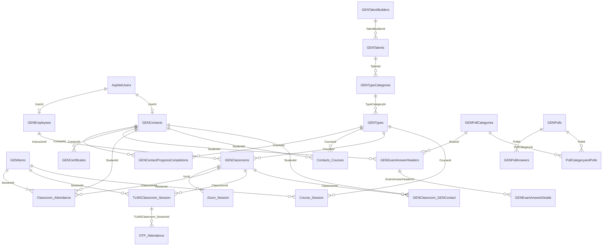
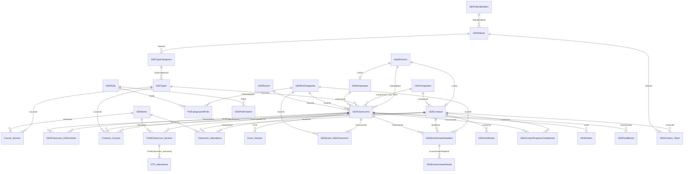
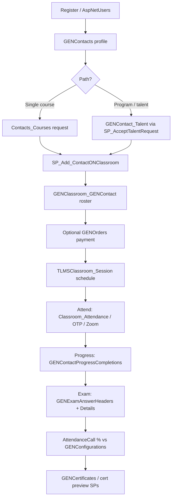
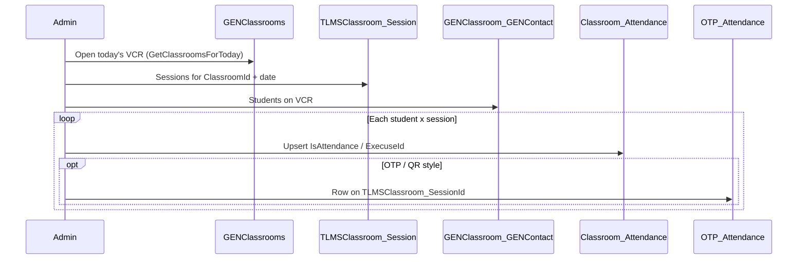
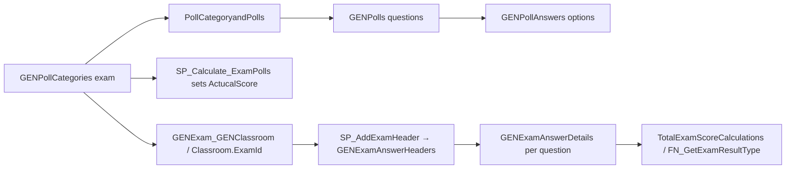
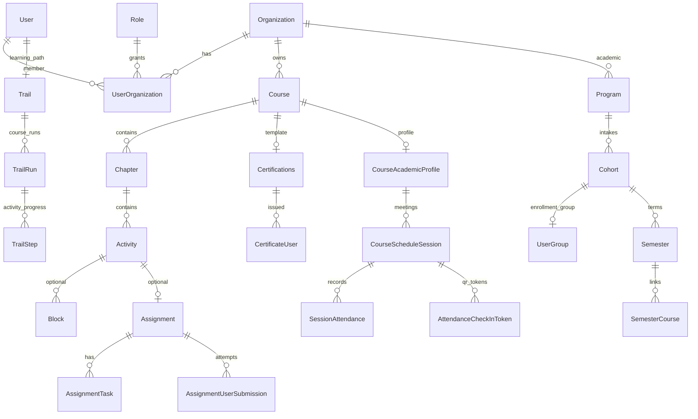
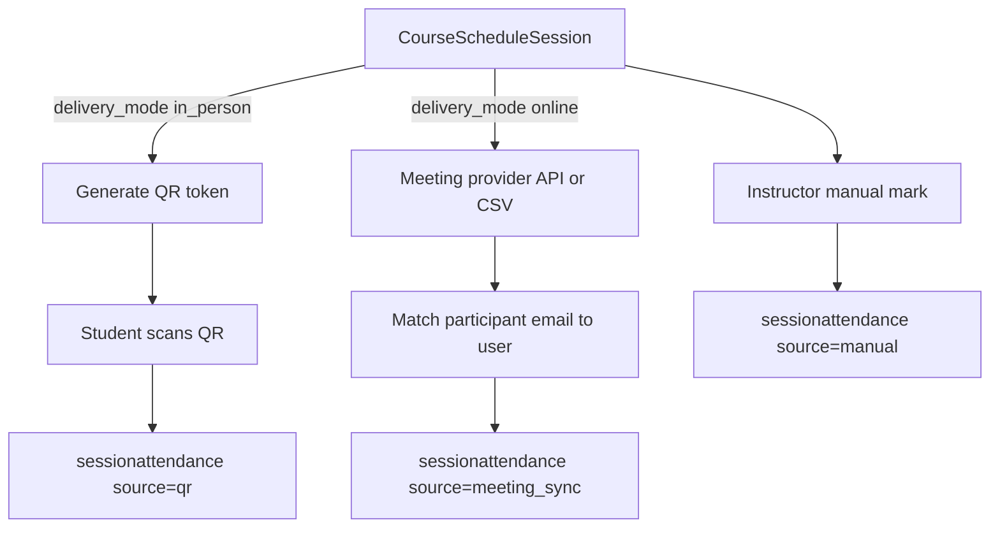

# Academy (EACA) → OmniLearn Database Migration

Internal engineering note for migrating the Egyptian Aviation Academy’s legacy LMS into OmniLearn.

**Sources analyzed**

| Artifact | Role |
|----------|------|
| [`Academy/Sawa_LTD.sql`](../../Academy/Sawa_LTD.sql) | UTF-8 T-SQL schema dump (`EACA_V2_Stage_23102024`) |
| [`Academy/scriptDb.sql`](../../Academy/scriptDb.sql) | UTF-16 T-SQL schema dump (`EACA_V2`, nearly identical) |
| [`Academy/SnapShotDb.bak`](../../Academy/SnapShotDb.bak) | SQL Server backup — **actual production data** (not readable as text) |
| [`Academy/TableRowCount.xlsx`](../../Academy/TableRowCount.xlsx) | Per-table row counts (~6.9M total rows) |

**Target:** OmniLearn PostgreSQL 16 schema under [`apps/api/src/db/`](../../apps/api/src/db/).

> Schema SQL dumps contain **no row-level seed data**. Volumes below come from `TableRowCount.xlsx`. Literal sample rows require restoring `SnapShotDb.bak` on SQL Server.

**Deep detail:**
- [§2.5](#25-complete-data-inventory--what-every-non-empty-table-holds) — **all 221 non-empty tables** + empty LMS tables + views  
- [§2.6](#26-old-database-relationships--full-fk-model) — **all table relationships** (including empty tables)  
- [§2.7](#27-business-logic--day-to-day-flows) — **how the LMS works day-to-day** (enroll → attend → exam → certify)  
- Companion: [`academy-eaca-old-db-relationships.md`](./academy-eaca-old-db-relationships.md) — every FK constraint listed  
- [§9](#9-old-database--detailed-reference-names-not-just-numbers) — roles, enums with English/Arabic names, field meanings  
- [§10](#10-bit-flags-0--1--what-they-mean-and-what-they-do) — every important **0/1 bit flag** explained  
- [§11](#11-how-to-see-unique-values-required-for-remaining-01-and-enums) — SQL to extract **real DISTINCT values** from `SnapShotDb.bak`

---

## 1. Executive summary

The Academy currently runs a **Sawa LTD** platform (ASP.NET Identity + Entity Framework + HangFire) on **SQL Server 2019 Express**. It is a generic CRM/CMS product with LMS features bolted on. Naming is misleading:

| LMS concept | Old table |
|-------------|-----------|
| Course | `GENTypes` |
| Lesson / session template | `GENItems` |
| Class offering / cohort (called “VCR”) | `GENClassrooms` |
| Exam / quiz | `GENPollCategories` |
| Student | `GENContacts` |
| Instructor | `GENEmployees` |

OmniLearn already has a cleaner, org-scoped design: **Course → Chapter → Activity**, progress via **Trail → TrailRun → TrailStep**, and an academic layer (**Program → Cohort → Semester** + `CourseScheduleSession`). This document maps old → new.

Where OmniLearn is missing a first-class feature the Academy needs (notably **attendance**), this doc specifies the **target tables and capture modes to build**, then maps legacy data into them. Attendance is in scope for migration — not deferred.

### Keep vs archive

| Migrate (P0 LMS) | Defer / archive |
|------------------|-----------------|
| Users, contacts, employees | `AuditLogs` + `AuditLogDetails` (~5.1M rows) |
| Courses, sessions, media | CRM\* / CRMSRV\* ticket system |
| Classrooms, enrollments | HangFire job tables |
| **Attendance** (QR / OTP + meeting) | PageOfPages dynamic UI meta-framework |
| Exams, answers, grades | Chat, push notifications |
| Progress, certificates, orders | Logistics, vehicles, galleries |
| Talents / talent builders (programs) | |

Rough LMS-relevant volume to migrate: **~1M+ rows** (including ~427k attendance). The other ~5.9M rows are audit/platform noise.

### High-level entity map

| Old | New (OmniLearn) |
|-----|-----------------|
| `AspNetUsers` + `GENContacts` | `user` + `userorganization` (learner) |
| `GENEmployees` | `user` + instructor role / `instructor` |
| `GENCompanies` | `organization` metadata / employer in `extra_metadata` |
| `GENTalentBuilders` / `GENTalents` | `program` (+ optional `trainingprogram`) |
| `GENTypes` | `course` (+ `courseacademicprofile`) |
| `GENItems` via `Course_Session` | `chapter` + `activity` |
| `GENClassrooms` | `cohort` + `usergroup` (offering of a course) |
| `TLMSClassroom_Session` / `Zoom_Session` | `courseschedulesession` (+ meeting URL metadata) |
| `GENClassroom_GENContact` / `Contacts_Courses` | `usergroupuser` + `trail` / `trailrun` |
| `GENPollCategories` + polls/answers | `assignment` + quiz `assignmenttask`s |
| `GENExamAnswerHeaders/Details` | `assignmentusersubmission` / `assignmenttasksubmission` |
| `GENContactProgressCompletions` | `trailstep` (+ `trailrun.status`) |
| `GENCertificates` | `certifications` + `certificateuser` |
| `Classroom_Attendance` + `OTP_Attendance` | **`sessionattendance`** (new) — see §3.3 / Phases 7–8 |

---

## 2. Old database deep-dive

### 2.1 Platform facts

- **DBMS:** Microsoft SQL Server 2019 Express (`MSSQL15.SQLEXPRESS`), compatibility level 130
- **Databases:** `EACA_V2` (prod-like), `EACA_V2_Stage_23102024` (stage)
- **Objects:** ~**502** `dbo` tables (**221** with data, **295** empty) + HangFire; ~**70** views; ~1180 stored procedures; ~225 functions
- **Auth:** ASP.NET Identity (`AspNetUsers`, roles, user-roles)
- **Non-empty tables:** 221; **total rows ~6,901,595** (full inventory in §2.5)

### 2.2 Core LMS ER diagram



### 2.3 P0 table catalog

Row counts from `TableRowCount.xlsx`. Soft-delete flags to filter: `IsDeleted = 0`, prefer `IsActive = 1` / `IsPublish = 1` where relevant.

#### Auth and people

##### `AspNetUsers` — 40,910 rows

Login identity. Key columns: `Id` (nvarchar 128 PK), `UserName`, `Email`, `PasswordHash`, `FirstName` / `SecondName` / `ThirdName`, `IsActive`, `PhoneNumber`, `OfficialOrganizationId` → `GENCompanies`, 2FA / lockout fields.

##### `AspNetRoles` — 14 rows / `AspNetUserRoles` — 16,227 rows

Role assignment. Map to OmniLearn `role` + `userorganization.role_id` (learner / instructor / admin), not 1:1 ASP.NET role names.

##### `GENContacts` — 51,607 rows — **students / learners**

Linked via `UserId` → `AspNetUsers`. Key LMS fields: `Name`, `FirstName` / `SeconName` (typo) / `ThirdName` / `FourthName`, `Email1` / `DefaultEmail`, `Phone1` / `Mobile1` / `DefaultPhone`, `IDNumber`, `BirthDate`, `GenderId`, `NationalityId`, `CompanyId`, `IsUser`, `IsDeleted`, `IsActive`.

**Security debt:** `ContactUserPassword` (and similar) may hold plaintext — never copy into OmniLearn; force password reset.

Huge CRM/EAV surface (235 columns including health fields, checkout, `String1`–`String5`). Migrate only identity + academy profile fields into `user.extra_metadata`.

##### `GENEmployees` — 824 rows — **instructors / staff**

`UserId` → `AspNetUsers`, optional `ContactId` → `GENContacts`. Key: `Name`, `FirstName`/`SecondName`/`ThirdName`, `Email`, `Telephone`, `DepartmentId`, `IsManager`, `IsActive`, `IsDeleted`, `IDNumber`.

##### `GENCompanies` — 6,045 rows

Organizations / employers. Academy itself is one company; others are employers of students. Map Academy → OmniLearn `organization`; keep employer refs in user metadata.

#### Catalog (courses and content)

##### `GENTypes` — 416 rows — **courses**

| Column | Meaning |
|--------|---------|
| `Id`, `Code`, `Name` | Identity |
| `Description`, `RichContent` | About / long description |
| `Objectives`, `Prerequisites`, `KnowledgeAcquired`, `Dependencies` | Learning outcomes |
| `FeesforEgyptian`, `FeesfornonEgyptians`, `Duration` | Pricing / length (strings) |
| `CourseType`, `TypeCategoryId`, `LanguageId` | Classification |
| `IsPublish`, `IsActive`, `IsDeleted` | Visibility |

##### `GENTypeCategories` — 1,886 rows

Hierarchical categories (`ParentId` self-FK). Linked to `TalentId` / `TalentBuilderId` for curriculum tracks. Also `CourseCategories` (767) many-to-many course↔category.

##### `GENItems` — 5,180 rows — **session / lesson templates**

Also used as inventory-like products. LMS-relevant: `Name`, `Code`, `Description`, `RichContent`, `VideoURL`, `Image`, `TypeId` → course, `DisplayOrder`, `SeesionType` (typo), `IsDeleted` / `IsActive` / `IsPublish`.

##### `Course_Session` — 4,041 rows

Ordered link: `CourseId` → `GENTypes`, `SessionId` → `GENItems`, `DisplayOrder`, `IsActive`.

##### `GENWikis` — 648 rows

CMS pages **and** certificate templates (`CertFrameId`, signature/background image fields, `Line1`–`Line4`). Certificates reference these via `GENCertificates.TemplateId`.

##### `GENFiles` — 31,339 rows

Polymorphic attachments via `BaseEntityId` + `EntityId`. Needs `BaseEntities` (203 rows) to interpret which parent type.

#### Offerings, enrollment, attendance

##### `GENClassrooms` — 2,996 rows — **class offerings (“VCR”)**

A scheduled instance of a course with instructor, dates, optional exam, meeting URL, price.

Key: `Name`, `Code`, `CourseId`, `InstructorId`, `ExamId`, `FromDateTime` / `ToDateTime`, `InteractiveMeetingURL`, `ClassRoomStatus`, `RoomId`, `Price`, `CurrencyId`, `OrganizationId` / `CompanyId`, roster counters (`Confirmed`, `Requested`, `Waiting`), `IsDeleted` / `IsActive` / `IsPublish`. Heavy denormalization (`Course_Name`, `Instructor_Name`, student fields).

##### `GENClassroom_GENContact` — 63,951 rows — **class roster**

`ClassroomId` + `StudentId`, `IsConfirmed`, `StudentStatus`, denorm student contact fields, `VoucherId`.

##### `Contacts_Courses` — 44,931 rows — **course-level enrollment**

`StudentId`, `CourseId`, optional `ClassRoomId`, `OrderId`, `TalentId`, `CourseStatus`, `TalentStatus` / `TalentCourseStatus`, `RequestDate` / `AcceptDate` / `RejectDate`, `Reason`.

**Dual enrollment model:** roster (`GENClassroom_GENContact`) vs course enrollment (`Contacts_Courses`). ETL must reconcile — see open business rules.

##### `TLMSClassroom_Session` — 25,268 rows

Scheduled delivery of a session inside a classroom: `ClassroomId`, `SessionId` → `GENItems`, `InstructorId`, `SessionDateTime` / `FromDateTime` / `ToDateTime`, `InteractiveMeetingURL`, `TypeSession`, `IsActive`.

##### `Classroom_Session_Instructor` — 15,634 rows

Extra instructors on a scheduled session + pricing (`Price`, `DisocuntPerecentage` typo, etc.).

##### `Classroom_Attendance` — 426,960 rows — **historical attendance**

`ClassroomId`, `SessionId` → `GENItems`, `StudentId`, `IsAttendance`, `ExecuseId` (excuse), `Notes`. Largest LMS table. Migrates into new OmniLearn `sessionattendance` (Phase 8, after Phase 7 builds the feature).

##### `OTP_Attendance` — 224 rows — **session check-in codes (QR/OTP precursor)**

Per scheduled session (`TLMSClassroom_SessionId`): `Value` (code), `ExpireDate`, `IsExpired`, `IsInstructorOtp`, `InstructorId`. Legacy used short-lived OTP codes for marking presence; OmniLearn replaces this with **QR check-in** (same idea: time-boxed token on the session that students scan/enter).

##### `Zoom_Session` — 18 rows — **online meeting links**

`VcrId` → classroom, `SessionId` → `GENItems`, `CourseId`, `TalentId`, `InteractiveMeetingURL`, `VideoURL`, `SessionDateTime`, `ZoomDuration`, `ZoomType`. Online sessions take attendance from the **meeting participant list** (Zoom/Teams/Meet), not QR.

#### Assessments

##### `GENPollCategories` — 65 rows — **exam definitions**

`Name`, `Code`, `ExamType` (int 0–12), `Weight`, `SuccessScore`, `ActucalScore` (typo), `Time` (minutes), `IsShuffled`, `QuestionDisplayType`, media fields, soft-delete flags.

##### `GENPolls` — 734 rows — **questions**

`Question`, `QuestionType`, `Weight`, `MinAnsNumber` / `MaxAnsNumber`, media, scoring tweaks.

##### `GENPollAnswers` — 1,876 rows — **choices**

`PollId`, `Answer`, `IsCorrect`, `Weight` / `Result`.

##### `PollCategoryandPolls` — 1,202 rows

Exam ↔ question link with `QdOrder`, optional `QuestionGroupId`.

##### Assignment links

- `GENExam_GENType` (239) — exam on course
- `GENExam_GENClassroom` (1,213) — exam on classroom
- `GENExam_GENItem` (1) — exam on session (almost unused)

##### `GENExamAnswerHeaders` — 17,156 rows — **attempt header**

`StudentId`, `ExamId`, `CourseId`, `ClassroomId`, `InstructorId`, timing (`StartDateTime`, `EndtDateTime` typo), scores (`AnnouncedDegree`, `ScoreDegree`, computed totals), `IP` / `MACAddress`, `ExamAnswerType`.

##### `GENExamAnswerDetails` — 99,737 rows — **per-question answers**

`ExamAnswerHeaderId`, `PollId`, `PollAnswerId`, `Score`, `Article` / `Value` (free text / numeric), `IsRevised`.

#### Progress, certificates, commerce, curriculum

##### `GENContactProgressCompletions` — 8,073 (+ 6,366 details)

`ContactId`, `ClassroomId`, `CourseId`, `CompletionValue`, `TotalRequiredProgressValue`, polymorphic `BaseEntityId`/`EntityId`. Details track video pages / elapsed time.

##### `GENCertificates` — 46,086 rows

`ContactId`, `CertificateName`, `SerialNo`, `TemplateId` → `GENWikis`, signature/image fields, polymorphic entity link.

##### `GENOrders` / `GENOrderDetails` — 3,701 each

Orders: `ContactId`, `TypeId` (course), `VcrId` (classroom), `TalentId`, `IsPaid`, payment transaction fields. Details: `ItemId`, prices, quantity.

##### `GENTalentBuilders` — 40 / `GENTalents` — 108

Curriculum / program hierarchy. Talents have duration, academic classification, scientific degree, date range. Categories and courses hang under talents.

##### `GENRatings` — 239,573 rows (P1)

Polymorphic ratings via `BaseEntityId` + `EntityId`. Defer unless product needs historical feedback.

### 2.4 What the data “looks like” (without `.bak` samples)

| Domain | Shape of data |
|--------|----------------|
| People | Arabic/English names, national IDs, multi-part names, emails often in `DefaultEmail` / `Email1` |
| Courses | ~416 catalog courses with fee strings for Egyptian vs non-Egyptian, duration text, objectives HTML/text |
| Classrooms | Dated offerings (~3k) with Zoom/meeting URLs, instructor assignment, status enums |
| Roster | Tens of thousands of student↔classroom links with confirmation/status ints |
| Exams | Small exam bank (65), richer attempt history (17k headers, ~100k answers) |
| Attendance | Dense session-level present/absent (~427k) + OTP codes + Zoom meeting URLs |
| Certs | Large issued-certificate set with serial numbers and template refs |

Restore `SnapShotDb.bak` before writing ETL to validate enum meanings (`CourseStatus`, `ExamType`, `ClassRoomStatus`, `StudentStatus`).

### 2.5 Complete data inventory — what every non-empty table holds

There are **221 non-empty tables** and **~6.9M rows**. Most rows are audit/platform noise. Below: **what the data actually is**, grouped by purpose. Row counts from `TableRowCount.xlsx`.

**Migration priority legend:** **P0** = must migrate · **P1** = useful if time · **Skip** = do not migrate to OmniLearn v1 (archive if needed)

#### A. Authentication and access (P0)

| Table | Rows | What data is inside |
|-------|-----:|---------------------|
| `AspNetUsers` | 40,910 | Login accounts: username, email, password hash, names, phone, active/lockout/2FA flags, org links |
| `AspNetRoles` | 14 | Permission role definitions (e.g. EACA Academy Admin, Trainer Admin, Trainee Admin — see §9.1) |
| `AspNetUserRoles` | 16,227 | Which user has which role |
| `AspNetUserClaims` | 1 | Rare extra identity claims |
| `Authentications` | 624 | Auth/session-related records |
| `SysUserLoginHistories` | 8,300 | Login history (audit-ish; optional archive) |

#### B. People — students, staff, companies (P0)

| Table | Rows | What data is inside |
|-------|-----:|---------------------|
| `GENContacts` | 51,607 | **Students/trainees**: full name parts, NID, birth date, gender/nationality (list values), default email/phone, company, soft-delete, Training/GraduateStudies flags, org-sponsored vs individual |
| `GENEmployees` | 824 | **Instructors/staff**: name, email, phone, department, manager flag, login link, hiring/birth dates |
| `GENCompanies` | 6,045 | Companies/employers and Academy org records |
| `CompanyInfoes` | 1,263 | Extra company profile fields |
| `GENContactEmails` | 15,775 | Additional emails per contact |
| `GENContactPhones` | 14,755 | Additional phones per contact |
| `GENAddresses` | 38,548 | Addresses (contacts/companies) |
| `GENEmails` / `GENPhones` | 268 / 398 | Generic email/phone entities |
| `GENCompanyEmails` / `Phones` | 13 each | Company contact channels |
| `ContactInfoes` | 15,078 | Extended contact info / role name snapshots |
| `GENActivateAccounts` | 25,332 | Account activation / invite records |
| `GENContactTypes` | 4 | Lookup: kinds of contacts |
| `GENContactCategories` | 3 | Lookup: contact categories |
| `GENEmployeeTypes` | 2 | Lookup: employee kinds |
| `GENEmployeeCategories` | 2 | Lookup: e.g. trainer category used in procs |
| `GENDepartments` | 6 | Departments |
| `GENSalutations` | 19 | Mr/Ms-style salutations |
| `AgeGroupContacts` | 4 | Age-group tagging |

#### C. Course catalog and content (P0)

| Table | Rows | What data is inside |
|-------|-----:|---------------------|
| `GENTypes` | 416 | **Courses**: name, code, description, rich HTML, objectives, prerequisites, Egyptian/non-Egyptian fees, duration, `CourseType` (classroom/self-study/online), category, language, publish/active/deleted |
| `GENTypeCategories` | 1,886 | Category tree; linked to talents |
| `CourseCategories` | 767 | Many-to-many course ↔ category |
| `GENType_Course` | 2 | Course prerequisites / dependencies |
| `GENItems` | 5,180 | **Lesson/session templates**: name, video URL, image, rich content, session type (lecture/workshop/…), prices (inventory leftovers), soft-delete |
| `Course_Session` | 4,041 | Ordered link: course → sessions |
| `GENItemFiles` | 1,330 | Files attached to sessions |
| `GENItemVideos` | 528 | Videos attached to sessions |
| `GENItemCategories` | 3 | Item category lookup |
| `GENWikis` | 648 | CMS pages **and certificate templates** (background, signatures, lines, QR) |
| `GENWikiCategories` | 93 | Wiki categories |
| `GENEntity_GENWiki` | 18 | Entity ↔ wiki links |
| `GENFiles` | 31,339 | File library (polymorphic via `BaseEntityId`/`EntityId`); folders vs files |
| `GENImages` | 1,793 | Image assets |
| `GENImageTypes` | 95 | Image type lookup |
| `GENVideos` | 7 | Video assets |
| `GENLinks` | 271 | URL links |
| `GENStyles` | 1,445 | UI/style metadata (icons/themes) |

#### D. Classrooms (VCR), schedule, roster (P0)

| Table | Rows | What data is inside |
|-------|-----:|---------------------|
| `GENClassrooms` | 2,996 | **Class offerings**: course, instructor, dates, meeting URL, exam, status (started/done/…), shift (morning/evening), prosecution/directorate, price, booking/payment settings, confirmed/requested/waiting counts |
| `GENClassroom_GENContact` | 63,951 | **Roster**: student in classroom, confirmed?, student status (regular/ban/stopped/dropped), booking type, payment type, denormalized student name/email/NID/mobile |
| `Contacts_Courses` | 44,931 | **Course enrollment**: student↔course, optional classroom/order/talent, CourseStatus / TalentStatus / TalentCourseStatus, request/accept/reject dates |
| `TLMSClassroom_Session` | 25,268 | **Scheduled meetings**: classroom + session template + instructor + datetime + meeting URL + session type |
| `Classroom_Session_Instructor` | 15,634 | Extra instructors on a session + pricing unit (per hour/day/course) |
| `Zoom_Session` | 18 | Zoom/online meeting rows bound to VCR/course/session |
| `GENRooms` | 47 | Physical rooms (Lab / Classroom / ActivityRoom / …) |
| `GENClassroomCategories` | 3 | Classroom category lookup |
| `TempVcrs` / `RandomNumberVCRLogs` | 12 / 89 | Temp/debug VCR helpers |
| `GENClassroomsLogDatas` | 10 | Classroom change logs |

#### E. Attendance (P0 — feature + data)

| Table | Rows | What data is inside |
|-------|-----:|---------------------|
| `Classroom_Attendance` | 426,960 | **Presence rows**: classroom + session item + student + `IsAttendance` (1=present, 0=absent) + excuse id + notes |
| `OTP_Attendance` | 224 | Time-boxed OTP/check-in codes per scheduled session; instructor vs student OTP |

#### F. Exams and grades (P0)

| Table | Rows | What data is inside |
|-------|-----:|---------------------|
| `GENPollCategories` | 65 | **Exam definitions**: name, ExamType (final/midterm/quiz/…), weight, pass score, time limit, shuffle |
| `GENPolls` | 734 | **Questions**: text, QuestionType (MCQ/T-F/value/article), weight, difficulty level, media |
| `GENPollAnswers` | 1,876 | **Choices**: text, `IsCorrect` key, weight |
| `PollCategoryandPolls` | 1,202 | Exam ↔ question order (+ question group) |
| `GENQuestionGroups` | 3 | Question groupings |
| `GENExam_GENClassroom` | 1,213 | Exam assigned to classroom |
| `GENExam_GENType` | 239 | Exam assigned to course |
| `GENExam_GENItem` | 1 | Exam assigned to session (almost unused) |
| `GENExamAnswerHeaders` | 17,156 | **Attempt header**: student, exam, course, classroom, scores, start/end time, IP/MAC, attempt type |
| `GENExamAnswerDetails` | 99,737 | **Per-question answers**: selected choice, free text (`Article`), score, revised flag |

#### G. Progress, certificates, programs (P0)

| Table | Rows | What data is inside |
|-------|-----:|---------------------|
| `GENContactProgressCompletions` | 8,073 | Progress summary per contact/classroom/course |
| `GENContactProgressCompletionDetails` | 6,366 | Detail: video pages read, elapsed time, etc. |
| `GENCertificates` | 46,086 | **Issued certs**: contact, name, serial number, template wiki, signature/image fields |
| `GENCertifications` / `Frames` | 2 / 2 | Cert product/frame config |
| `GENCertification_Requests` | (see related) | Cert request workflow |
| `GENTalentBuilders` | 40 | Top-level program builders |
| `GENTalents` | 108 | Talent/program tracks under builders |
| `GENContact_Talent` | 648 | Student application to a talent (booking/payment status) |
| `GENTalents_Generic` | 921 | Generic talent UI/tab config |
| `AchievementsOpenBals` | 280 | Achievement opening balances / related |

#### H. Orders and payments (P0 metadata / P1 full commerce)

| Table | Rows | What data is inside |
|-------|-----:|---------------------|
| `GENOrders` | 3,701 | Orders: contact, course type, VCR, talent, paid flag, payment transaction fields |
| `GENOrderDetails` | 3,701 | Line items: item, qty, prices |
| `GENReturnedOrders` | 67 | Return/refund orders |
| `GENPaymentMethods` | 7 | Payment method lookup |
| `GENCurrencies` | 2 | Currencies |
| `GENDiscountCards` | 5 | Vouchers/discounts |
| `GENEntityPricings` | 647 | Price lists for entities (courses/sessions/instructors) |

#### I. Lookups and geo (P0 for referenced values)

| Table | Rows | What data is inside |
|-------|-----:|---------------------|
| `GENListValues` | 3,328 | Shared dropdown values (gender, nationality, language, excuses, …) |
| `GENListValuesTypes` | 50 | Types/categories of list values |
| `BaseEntities` | 203 | Polymorphic type registry (`TableName`, name) — needed to interpret files/ratings/progress |
| `BaseEntityFields` | 7,185 | Field metadata for dynamic entities |
| `GENStatus` | 9 | Workflow statuses |
| `GENCountries` / `Cities` / `Governorates` / `Districts` / `Regions` / `Provinces` | geo | Location lookups |
| `GENIndustries` | 25 | Industry lookup |
| `GENBranches` / types / hours | few | Branch config |
| `GENConfigurations` | 174 | App configuration key/values |
| `LanguagePercentage` | 6 | Language mix settings |
| `FontSettings` | 21 | UI fonts |
| `HTMLTemplates` | 5 | HTML templates |

#### J. Feedback and ratings (P1)

| Table | Rows | What data is inside |
|-------|-----:|---------------------|
| `GENRatings` | 239,573 | Ratings on polymorphic entities (often sessions) |
| `GENFeedBacks` | 10,810 | Feedback submissions |
| `GENFeedbackReplies` | 2,522 | Replies to feedback |
| `GENFeedBackCategories` | 9 | Feedback categories |
| `GENComments` | 1 | Comments (almost empty) |
| `GENCommentTypes` | 7 | Comment types |
| `GENReacts` | (likes) | Like/dislike reactions |

#### K. Imports and staging (Skip / archive)

| Table | Rows | What data is inside |
|-------|-----:|---------------------|
| `VCRContactImportDatas` | 31,268 | Bulk import rows for VCR contacts |
| `VCRContactImport` / `Fields` | 3 / 7 | Import job definitions |
| `ContactImport` / `Fields` | 14 / 7 | Contact import jobs |
| `CompanyImport` / `Fields` | 80 / 2 | Company imports |
| `TypeImport` / `Fields` | 10 / 7 | Course imports |
| `GENWikiImport` / `Fields` | 10 / 3 | Wiki imports |
| `ImportLogs` | 668 | Import run logs |
| `TempSessions` / `TempRPTBulks` / `TempGenTypeCategories` | temps | Temporary report/session data |
| `DeleteInFuture` | 506 | Soft-delete queue |

#### L. Chat, push, notifications (Skip)

| Table | Rows | What data is inside |
|-------|-----:|---------------------|
| `GENPushNotifications` | 108,215 | Push notification payloads/history |
| `GENPushNotificationArchives` | 210 | Archived pushes |
| `PushMSGUsers` / `PushMSGs` | 9,267 / 176 | Push message fan-out |
| `GENChatUserConnections` | 56,223 | Chat presence/connections |
| `GENChatStatus` | 29,647 | Chat user status |
| `GENChatMessages` | 373 | Chat messages |
| `GENChatGroups` / users / messages / pairs | small–medium | Group chat |

#### M. Dynamic UI / PageOfPages framework (Skip)

| Table | Rows | What data is inside |
|-------|-----:|---------------------|
| `PageOfPageFeilds` | 39,925 | Dynamic form field definitions |
| `RelatedPageofPages` | 54,037 | Page relationship graph |
| `PageOfPageField_Role` | 13,273 | Which role sees which field |
| `PageOfPages` / relations / tabs / reports | thousands | Entire dynamic CMS/UI builder |
| `BaseTab*` / `Basetab*` | various | Tab configuration for entities |
| `GENTranslate_*` | many small | Translations for UI/entities (AR/EN) |
| `GENPointers` | 10,622 | Navigation/pointer metadata |
| `GENEasyAccesses` | 57 | Shortcut/easy-access links |

#### N. Audit, checkout, errors (Skip — archive only)

| Table | Rows | What data is inside |
|-------|-----:|---------------------|
| `AuditLogDetails` | **4,147,652** | Field-level change details |
| `AuditLogs` | **968,393** | Change headers |
| `CheckOutHistories` | 55,300 | Who checked out which record for editing |
| `SysErrorLogs` | 923 | Application errors |
| `TransmissionHistroys` | 28,137 | Transmission/sync history (*typo in name*) |
| `ContactLogDatas` / company/type/wiki logs | thousands | Entity change logs |
| `GENOperationsLogs` | 17 | Operation logs |

#### O. CRM / tickets (Skip)

| Table | Rows | What data is inside |
|-------|-----:|---------------------|
| `CRMSentEmails` | 52 | CRM emails sent |
| `CRMSources` / types | 18 / 1 | Lead sources |
| `CRMDealTypes` | 2 | Deal types |
| `CRMSRVTicketTypes` | 4 | Service ticket types |
| Most other `CRM*` / `CRMSRV*` | **0 rows** | Empty CRM schema leftovers |

#### P. Jobs / HangFire / system (Skip)

| Table | Rows | What data is inside |
|-------|-----:|---------------------|
| `Job` / `JobParameter` | 194 / 776 | Background jobs |
| `State` / `Hash` / `Counter` / `AggregatedCounter` / `Set` / `Server` | HangFire | Job queue infrastructure |
| `__MigrationHistory` | 294 | EF migrations history |
| `sysdiagrams` | 1 | SSMS diagram |

#### Q. Misc content / marketing (P1 or Skip)

| Table | Rows | What data is inside |
|-------|-----:|---------------------|
| `GENNews` / categories | 5 / 2 | News posts |
| `GENHomeSliders` | 6 | Homepage banners |
| `GENBlogs` | 1 | Blog |
| `GENTags` / categories | 1 / 1 | Tags |
| `Reports` | 53 | Saved report definitions |
| `Emogies` | 6 | Emoji lookup (*typo*) |
| `GenRoles` | 1,307 | **Separate** from AspNetRoles — Sawa internal role/page rights (UI), not the same as Identity roles |

---

#### R. Translations / i18n (Skip bulk — migrate AR/EN course names selectively)

Arabic/English (and other) label overrides for entities. Useful if OmniLearn needs bilingual course/wiki titles.

| Table | Rows | What data is inside |
|-------|-----:|---------------------|
| `GENTranslate_PageOfPageFeilds` | 1,927 | Translations of dynamic form fields |
| `GENTranslate_Wiki` | 1,636 | Wiki/page translations |
| `GENTranslate_PageOfPageRelation` | 971 | Page-relation label translations |
| `GENTranslate_GenericTab` | 386 | Generic tab translations |
| `GENTranslate_Country` | 367 | Country name translations |
| `GENTranslate_BackendPage` | 352 | Backend page translations |
| `GENTranslate_Type` | 313 | **Course (`GENTypes`) name translations** — P1 if bilingual catalog needed |
| `Translate_BaseTabs` | 170 | Base tab translations |
| `GENTranslate_ListValue` | 131 | Dropdown value translations |
| `GENTranslate_TypeCategory` | 131 | Category translations |
| `GENTranslate_WikiCategory` | 59 | Wiki category translations |
| `GENTranslate_City` | 56 | City translations |
| `GENTranslate_BackendPageSection` | 40 | Backend section translations |
| `GENTranslate_Role` | 3 | Role name translations |
| `GENTranslate_HomeSlider` | 2 | Slider translations |
| `GENTranslate_News` | 1 | News translations |
| `Translate_PageOfPageCustomFieldTabs` | 4 | Custom field tab translations |

Empty but present for future use: `GENTranslate_Contact`, `GENTranslate_Poll`, `GENTranslate_PollCategory`, `GENTranslate_PollAnswer`, `GENTranslate_GENTalent`, `GENTranslate_GENTalentBuilder`, `GENTranslate_ClassRoom`, `GENTranslate_Items`, and many more `GENTranslate_*` (see §2.5.1).

#### S. PageOfPages / BaseTab UI framework — full list (Skip)

Dynamic admin UI builder. Not learning content; powers the old Sawa back-office screens.

| Table | Rows | What data is inside |
|-------|-----:|---------------------|
| `GENPageOfPages` | 348 | Page definitions (screens in admin UI) |
| `PageOfPageRelations` | 1,031 | How pages link to each other |
| `PageOfPageCustomFieldTabs` | 4 | Custom field tabs on pages |
| `PageofPageReport_Role` | 3 | Which roles can run page reports |
| `BaseTabs` | 106 | Tab definitions |
| `BaseTabFields` | 335 | Fields shown on tabs |
| `BaseTabGENPageOfPages` | 1,207 | Tab ↔ page links |
| `BasetabGENPageOfPages_Field` | 1,004 | Field placement on page tabs |
| `BasetabGENPageOfPagesRoles` | 902 | Role access to page tabs |
| `BaseTabBaseEntities` | 662 | Tab ↔ entity type links |
| `BaseEntityRelations` | 573 | Relations between dynamic entities |
| `GENBackendPages` | 261 | Backend menu/pages |
| `GENBackendPageSections` | 54 | Backend page sections |
| `GENBackendPageSectionCategories` | 6 | Section categories |
| `GENFilterEntities` | 9 | Filter definitions for entity lists |

#### T. Remaining lookups / geo / config (previously abbreviated)

| Table | Rows | What data is inside |
|-------|-----:|---------------------|
| `GENCities` | 28 | Cities |
| `GENGovernorates` | 9 | Governorates |
| `GENDistricts` | 9 | Districts |
| `GENRegions` | 8 | Regions |
| `GENProvinces` | 2 | Provinces |
| `GENCompanyTypes` | 11 | Company type lookup |
| `GENCompanyPhones` | 13 | Company phone numbers |
| `GENBrands` | 10 | Brands (item/inventory leftover) |
| `GENPhoneTypes` | 6 | Phone type lookup |
| `GENEmailTypes` | 1 | Email type lookup |
| `GENUnits` | 1 | Unit of measure |
| `GENTypeStatus` | 15 | Status values for types |
| `GENClassifications` | 2 | Classification lookup |
| `GENSections` | 2 | Content sections |
| `GENRawDataTypes` | 2 | Raw-data import types |
| `GENBranchTypes` | 2 | Branch types |
| `GENBranchHours` | 7 | Branch opening hours |
| `GENProfessionalExperiences` | 2 | Professional experience lookup |
| `GENCertificationFrames` | 2 | Certificate frame templates |
| `GENTagCategories` | 1 | Tag categories |
| `GENEntity_Tag` | 5 | Entity ↔ tag links |
| `GENConfigurationCategories` | 5 | Config grouping |
| `GENNewsCategories` | 2 | News categories |
| `CRMSourceTypes` | 1 | CRM source type |
| `Table` | 17 | Generic “Table” meta (framework) |

#### U. Remaining chat / log / media scraps

| Table | Rows | What data is inside |
|-------|-----:|---------------------|
| `GENChatPairConnections` | 93 | 1:1 chat pairing |
| `GENChatGroupMessages` | 66 | Group chat messages |
| `GENChatGroupUsers` | 39 | Group membership |
| `CompanyLogDatas` | 80 | Company change log |
| `TypeLogDatas` | 10 | Course (`GENTypes`) change log |
| `GENWikiLogDatas` | 20 | Wiki change log |
| `GENWikiVideos` | 3 | Videos on wikis |
| `ContactImportFields` / `TypeImportFields` / `VCRContactImportFields` / `CompanyImportFields` / `GENWikiImportFields` | 7/7/7/2/3 | Column maps for import jobs |

---

**Volume summary**

| Bucket | Approx rows | Approx tables | Action |
|--------|------------:|--------------:|--------|
| Audit logs | ~5.1M | 2 | Archive offline; do not load into OmniLearn |
| LMS core (people, courses, VCR, exams, attendance, certs, orders) | ~1.0M | ~40 | Migrate (P0) |
| Ratings / feedback / push / chat | ~0.45M | ~20 | Skip or P1 selectively |
| PageOfPages + BaseTab + translations | ~0.12M | ~40 | Skip (UI framework + i18n); optionally migrate `GENTranslate_Type` |
| Lookups / geo / config | ~10k | ~40 | Migrate referenced values only |
| Imports / temps / HangFire / CRM scraps | ~40k | ~50 | Skip |
| **Empty tables** | 0 | **295** | Schema only — see §2.5.1 |
| **Views** | n/a | **~70** | Read models — see §2.5.2 |

**Coverage:** all **221 non-empty** tables from `TableRowCount.xlsx` are listed above (sections A–U). Schema has **502** `dbo` tables total; **295** are empty.

### 2.5.1 Empty tables that still matter (LMS-named, 0 rows)

These exist in the schema but have **no rows** in the snapshot. Do not ignore the names — some are features the Academy expected or used in other environments.

| Area | Empty tables | Meaning |
|------|----------------|---------|
| Identity extras | `AspNetUserLogins`, `AspNetUserAddresses`, `AspNetUserPhones` | External logins / extra user contact |
| Exams | `Course_Question`, `GENExamAutoGenerators`, `GENExamGeneratorTags`, `GENExam_GENTalent`, `GENExam_Generic` | Auto-exam generation; exam↔talent |
| Items/media | `GENItemAttachments`, `GENItemAudios`, `GENItemImages`, `GENItemDetails`, `GENItem_Sessions`, `GENItemGroups`, `GENItem_Bundle`, `GENItemPromotions`, `GENItemTags`, … | Richer session/product model unused in this dump |
| Certificates | `GENCertification_Requests` | Cert request workflow (views exist) |
| Contacts | `GENContactAddresses`, `GENContactComments`, `GENContact_Generic`, `GENContact_News`, `EACA_NewContacts`, `SchedulerContacts` | Extra contact features |
| Talents | `DependencyTalentBuilders` | Talent builder dependencies |
| Users/devices | `GENUserDevices`, `GENUserLikes`, `GENUserLocations` | Mobile/social |
| Wiki media | `GENWikiAudios`, `GENWikiFiles` | Extra wiki media |
| Vehicles | `GENVehicleTypes`, `GENVehicleUsers`, … | Non-LMS Sawa module |
| CRM | most `CRM*` / `CRMSRV*` | Empty CRM/ticket schema |
| Translations | dozens of `GENTranslate_*` | Ready for AR/EN labels not yet filled |

Full empty list: **295 tables** in `TableRowCount.xlsx` with `RowCount = 0`.

### 2.5.2 Important views (how the app reads data)

Views are not stored data; they **join and label** tables (including 0/1 → Arabic/English names). Useful for understanding business meaning during migration.

| View | What it shows |
|------|----------------|
| `Contact_View` / `Contact_GridView` / `Contact_View_Rpt` | Student grid with role, VCR count, student type (individual vs org) |
| `Employee_View` / `Employee_TranslateView` | Instructor/staff listing |
| `Company_View` / `Companies_TranslateView` | Companies |
| `GENType_View` / `Type_TranslateView` / `TypeCategory_TranslateView` | Course catalog (+ translations) |
| `Items_View` / `Item_TranslateView` | Session/lesson catalog |
| `Classroom_View` / `Classroom_View_Rpt` / `ClassRoom_TranslateView` | VCR offerings with status/payment/shift labels |
| `VCRContact_View` / `Search_VCRContact_View` | Roster search |
| `Courses_Requestes` | Course enrollment requests |
| `Talents_Requestes` / `GENTalents_View` / `GENTalentBuilders_View` | Talent applications & catalog |
| `PollCategory_View` / `PollCategoryWithRole_View` / `GENPolls_View` / `QuestionGroup_View` | Exam bank |
| `ExamHeaderResults` | Exam attempt results |
| `GENExamAutoGenerator_View` | Auto-exam generator UI |
| `GENCertification_Requests_View` / `GENCertificationFrames_View` | Certificate requests/frames |
| `Rpt_AchievementsDtls_View` | Achievement report (GroupType, IsPlan, Prosecution labels) |
| `NACA_MenuView` | Menu structure |
| `*_TranslateView` (many) | Bilingual wrappers over list/geo/entity tables |

### 2.6 Old database relationships — full FK model

The schema declares **2,243 foreign keys** across **502** tables. Empty tables are still in this graph — many are parents (lookups never filled) or children of unused modules.

**Full constraint list (every FK, every empty table’s links):**  
→ [`academy-eaca-old-db-relationships.md`](./academy-eaca-old-db-relationships.md)

| Metric | Value |
|--------|------:|
| Declared FK constraints | 2,243 |
| Tables that are FK children | 440 |
| Tables that are FK parents | 180 |
| Tables with **no** declared FK | 49 (often soft IDs / Identity junctions) |
| Empty tables still used as **parents** | 81 |

#### 2.6.1 Mental model (layers)

```text
┌─────────────────────────────────────────────────────────────────┐
│  IDENTITY          AspNetUsers / AspNetRoles / AspNetUserRoles  │
└───────────────┬─────────────────────────────────────────────────┘
                │ UserId
        ┌───────┴────────┐
        ▼                ▼
  GENContacts      GENEmployees          GENCompanies
  (students)       (instructors)         (employers / orgs)
        │                │                      │
        │                │                      │
┌───────┴────────────────┴──────────────────────┴─────────────────┐
│  CATALOG                                                         │
│  GENTalentBuilders → GENTalents → GENTypeCategories → GENTypes   │
│                                              ↓                   │
│                                         Course_Session           │
│                                              ↓                   │
│                                           GENItems               │
│                                    (lessons / session templates) │
└───────────────────────────────┬─────────────────────────────────┘
                                │ CourseId / SessionId
┌───────────────────────────────┴─────────────────────────────────┐
│  OFFERING (VCR)          GENClassrooms                           │
│    ← InstructorId (employee)  ← RoomId, City, Country, …         │
│    ← ExamId (optional poll category)  ← WikiId, Style, …         │
└───────┬───────────────────────┬─────────────────────────────────┘
        │                       │
        ▼                       ▼
 GENClassroom_GENContact   TLMSClassroom_Session
 Contacts_Courses          Zoom_Session
 GENOrders (VcrId)              │
        │                       ▼
        │              Classroom_Attendance / OTP_Attendance
        ▼
 GENExam_* / GENCertificates / GENContactProgressCompletions / GENFeedBacks
```

#### 2.6.2 Core LMS relationship diagram (extended)



#### 2.6.3 Hub cards — what each central table owns

| Hub | Rows | Outgoing FKs (depends on) | Incoming children (examples) |
|-----|-----:|---------------------------|------------------------------|
| `AspNetUsers` | 40,910 | — (Identity root) | `GENContacts`, `GENEmployees`, audit `*ById`, soft deletes |
| `GENContacts` | 51,607 | User, company, geo, lookups (~42) | Roster, requests, exams, certs, progress, attendance, feedback |
| `GENEmployees` | 824 | User, company, geo (~25) | `GENClassrooms.InstructorId`, ratings, sessions |
| `GENTypes` | 416 | Category, media, wiki, style (~9) | Classrooms, `Course_Session`, `Contacts_Courses`, progress |
| `GENItems` | 5,180 | Media, wiki, style (~16) | `Course_Session`, `TLMSClassroom_Session`, attendance |
| `GENClassrooms` | 2,996 | Course, instructor, exam, room, geo, company, wiki (~22) | Roster, sessions, attendance, exams, orders, certs, Zoom, feedback |
| `GENPollCategories` | 65 | Roles, styles (~8) | Questions via `PollCategoryandPolls`, exam headers, classroom exam link |
| `GENTalents` | 108 | TalentBuilder, lookups (~8) | Type categories, `GENContact_Talent`, `GENTalents_Generic` |

#### 2.6.4 Junction / edge tables (many-to-many)

These are the “glue” rows — most migration volume lives here.

| Junction | Links | Rows | Role in the flow |
|----------|-------|-----:|------------------|
| `Course_Session` | `GENTypes` ↔ `GENItems` | 4,041 | Course curriculum order |
| `GENClassroom_GENContact` | VCR ↔ student | 63,951 | **Confirmed roster** (enrolled on offering) |
| `Contacts_Courses` | student ↔ course (+ optional VCR) | 44,931 | **Course request / enrollment intent** |
| `GENContact_Talent` | student ↔ talent program | (see inventory) | Program admission (`SP_AcceptTalentRequest`) |
| `PollCategoryandPolls` | exam ↔ question | 1,202 | Exam composition |
| `GENExam_GENClassroom` | exam ↔ VCR | 1,213 | Which exams run on which offering |
| `GENTalents_Generic` | talent extras ↔ VCR | 921 | Talent↔classroom generic link |

#### 2.6.5 Empty tables that still have relationships

**81 empty parents** are still referenced by other tables’ FKs. Examples:

| Empty parent | Still referenced by |
|--------------|---------------------|
| `GENCertification_Requests` | (itself empty; views expect it) — schema for cert workflow |
| `GENBookings` / `GENMediaFiles` / `GENSessions` | Soft/orphaned LMS names in schema |
| `Instructor_Courses` | Planned instructor↔course assignment (unused in snapshot) |
| `GENContactCourses` / `GENContact_GENType` | Alternate contact↔course edges (unused; live path is `Contacts_Courses`) |
| Many `GENTranslate_*` | Bilingual rows ready but empty |
| Most `CRM*` / `CRMSRV*` | Full ticket schema with FKs, zero data |
| Vehicle / logistics tables | Non-LMS module, FK-complete, empty |

**1,331 FKs** have an **empty child** (whole unused feature trees).  
**193 FKs** point at an **empty parent** (columns exist on live tables that never resolve).

Full per-empty-table link list: companion doc section *“All empty tables and their FK links”*.

#### 2.6.6 Tables with no declared FK (49)

Notable: `AspNetUserRoles` (Identity composite, often without FK in older schemas), import staging tables, some log/merge helpers. They still participate via **application-level IDs** — treat as soft relationships when reading SPs.

---

### 2.7 Business logic & day-to-day flows

Legacy logic lives in **~1,180 stored procedures** and **~225 functions**, not only in FKs. Below is how a normal Academy day uses the tables.

#### 2.7.1 Domain vocabulary (used in procedures)

| Everyday word | Table / field | Notes |
|---------------|---------------|-------|
| Course | `GENTypes` | Catalog product |
| Lesson / session template | `GENItems` | Reusable session definition |
| VCR / classroom / offering | `GENClassrooms` | A dated run of a course with an instructor |
| Roster seat | `GENClassroom_GENContact` | Student on a VCR |
| Course request | `Contacts_Courses` | Ask / book a course (may later bind `ClassRoomId`) |
| Scheduled session instance | `TLMSClassroom_Session` | Concrete meeting of a VCR (date/time + `GENItems`) |
| Attendance mark | `Classroom_Attendance` | Student × session × VCR |
| OTP check-in | `OTP_Attendance` | Tied to `TLMSClassroom_Session` |
| Online meeting | `Zoom_Session` | `VcrId` → classroom |
| Exam bank | `GENPollCategories` + `GENPolls` + answers | “Poll” = question |
| Exam attempt | `GENExamAnswerHeaders` + `Details` | One header per student attempt |
| Progress | `GENContactProgressCompletions` (+ Details) | % complete for an entity inside a VCR |
| Certificate | `GENCertificates` | Issued after attendance/rules |
| Talent / track | `GENTalents` / builders | Multi-course program |
| Order / payment | `GENOrders` (`VcrId`) | Commercial side of a VCR seat |

#### 2.7.2 End-to-end learner journey



#### 2.7.3 Flow A — Build catalog (admin, occasional)

1. Create **talent builder** → `GENTalentBuilders`
2. Create **talent** → `GENTalents`
3. Create **type category** → `GENTypeCategories` (under talent)
4. Create **course** → `GENTypes`
5. Create **session templates** → `GENItems`
6. Link curriculum → `Course_Session` (course ↔ items, ordered)
7. Optionally attach media/wiki/style FKs on type/item

**Day-to-day:** rare after go-live; mostly content team.

#### 2.7.4 Flow B — Open a VCR (training admin)

1. Insert `GENClassrooms` with `CourseId`, `InstructorId`, dates, status (`ClassRoomStatus`: Planned → Open → Started → Done / Dropped)
2. Optional: `ExamId` → `GENPollCategories`, `RoomId`, geo, company/org
3. Generate schedule rows → `TLMSClassroom_Session` (`ClassroomId` + `SessionId`/`GENItems`, `SessionDateTime`, `TypeSession`)
4. Optional online: `Zoom_Session` (`VcrId`)
5. Link exams to offering → `GENExam_GENClassroom`

**Procs/views:** `GetClassroomDetailsById`, `GetClassroomsForToday` / `GetClassroomToday`, `Classroom_View`.

#### 2.7.5 Flow C — Enroll a student (daily ops)

Two layers exist — **do not collapse them** in migration:

| Step | Table | Procedure | Meaning |
|------|-------|-----------|---------|
| 1. Request / interest | `Contacts_Courses` | `SP_CheckStudent_Request_Course` | Student wants a course (status / booking fields) |
| 2. Seat on VCR | `GENClassroom_GENContact` | **`SP_Add_ContactONClassroom`** | If no row: insert `IsConfirmed=1`, `StudentStatus`, `PaymentTypeId`, `BookingTypeId`; else update payment/booking |

```text
SP_Add_ContactONClassroom(@ClassroomId, @ContactId, @PaymentStatus, @BookingStatus)
  IF NOT EXISTS roster row
    INSERT GENClassroom_GENContact (IsConfirmed=1, StudentStatus=0, PaymentTypeId, BookingTypeId)
  ELSE
    UPDATE PaymentTypeId, BookingTypeId
```

Voucher variant: `SP_Add_ContactONClassroom_Voucher`.  
Talent path: `SP_AcceptTalentRequest` → `INSERT GENContact_Talent`.

**Day-to-day:** registrars enroll dozens/hundreds; roster is the source of truth for “who is in this VCR”.

#### 2.7.6 Flow D — Run a session day (instructors / attendance)



- **Bulk marks:** `Classroom_Attendance` (~427k rows) — `ClassroomId` + `StudentId` + `SessionId` + `IsAttendance` + optional `ExecuseId` (excuse via `GENListValues`)
- **Filter UI:** `SP_ClassroomAttendanceFilter` joins VCR → roster → contacts → items → `TLMSClassroom_Session` → attendance → excuse name
- **OTP path:** `OTP_Attendance` → `TLMSClassroom_Session` (smaller volume)
- **Online:** `Zoom_Session` for meeting metadata; attendance may still land in `Classroom_Attendance`

**Attendance % (certificate gate):** function **`AttendanceCall(ContactId, ClassroomId)`**

```text
AttDur = COUNT(distinct Classroom_Attendance) for student on VCR
VCRDur = COUNT(TLMSClassroom_Session where ClassroomId and TypeSession = 0)
percentage = (AttDur / VCRDur) * 100   (or 100 if VCRDur = 0)
```

Compared later to `GENConfigurations.Name = 'PrecentageAttendance'` (threshold).

#### 2.7.7 Flow E — Progress inside a VCR

- **`SP_AddContactProgressCompletion`** inserts `GENContactProgressCompletions` (`ContactId`, `ClassroomId`, `BaseEntityId`, `EntityId`, `TotalRequiredProgressValue=100`) then detail rows
- **`FN_ProgressDone`** returns bit: `CompletionPercentage = 100` for that contact/classroom/entity

Used for content completion (wiki/item-like entities), separate from attendance %.

#### 2.7.8 Flow F — Exams



1. Author exam = `GENPollCategories`; questions = `GENPolls`; options = `GENPollAnswers`
2. Compose via `PollCategoryandPolls`; **`SP_Calculate_ExamPolls`** sums question weights → `ActucalScore`
3. Bind to VCR via `GENExam_GENClassroom` and/or `GENClassrooms.ExamId`
4. Student sits exam → **`SP_AddExamHeader`** (idempotent if header exists) → answer details
5. Scoring functions compute pass/fail / need-revision

**Day-to-day:** exam sessions at end of VCR or module; ~17k headers / ~100k detail rows in snapshot.

#### 2.7.9 Flow G — Certificates

1. Check attendance via `AttendanceCall` vs `PrecentageAttendance` config  
2. Preview/issue SPs: `SP_ContactCertificateClassRoom`, `…Course`, `…Talent`, `…Track`  
3. Persist → `GENCertificates` (contact + codes/names; classroom/course context in SP joins)  
4. Empty-but-designed: `GENCertification_Requests` (+ view) for request workflow  

#### 2.7.10 Flow H — Feedback & commerce (supporting)

- After VCR: `SP_Add_FeedBackClassroom_AddNew` / course feedback → `GENFeedBacks`
- Paid seat: `GENOrders` / `GENOrderDetails` with `VcrId`; `SP_AddOrderPaymentTransaction`
- Ratings of instructor/session: report procs `Rpt_VCRPollReport*`, `SP_BK_SelectVCRRateInstructorH_ByVcrId`

#### 2.7.11 “A day in the life” map

| Who | Typical actions | Tables / procs touched |
|-----|-----------------|------------------------|
| **Registrar** | Create contact, enroll on VCR, take payment | `GENContacts`, `SP_Add_ContactONClassroom`, `GENOrders` |
| **Training admin** | Open VCR, assign instructor, publish schedule | `GENClassrooms`, `TLMSClassroom_Session`, `Zoom_Session` |
| **Instructor** | Mark attendance, run exam, see roster | `Classroom_Attendance`, `OTP_*`, exam headers, `GetContactsByClassroomId` |
| **Student** | Request course, attend, sit exam, download cert | `Contacts_Courses`, attendance, `GENExamAnswer*`, `GENCertificates` |
| **Talent admin** | Accept into program, track multi-course progress | `SP_AcceptTalentRequest`, `GENContact_Talent`, talent calc functions |
| **Content admin** | Courses, items, exam bank | `GENTypes`, `GENItems`, `Course_Session`, polls |
| **System** | HangFire jobs, audit | `HangFire.*`, `AuditLogs` (archive — not LMS truth) |

#### 2.7.12 Status state machines (operational)

**VCR (`ClassRoomStatus` via `GETClassRoomStatusName`):**  
`3 Planned` → `4 Open` → `0 Started` → `2 Done` (or `1 Dropped`)

**Roster student (`StudentStatus`):** Regular / Ban / Stopped / Dropped (see §9)

**Course request (`Contacts_Courses` / CourseStatus):** Requested → … → Completed (see §9; note buggy duplicate in T-SQL `=3`)

**Talent course progress functions:** Not started / In progress / Failed / Succeeded (`Talent*Courses` helpers)

#### 2.7.13 What the FK graph does *not* show

- Soft references (IDs without FK) in logs, PageOfPages, some generics  
- Business rules inside SPs (attendance threshold, idempotent enroll/exam)  
- UI-only joins in **views** (§2.5.2)  
- Empty modules that are still “designed” (CRM, vehicles, many translates)

Use **§2.6 + companion FK file** for structure, **§2.7 + §9–§10** for meaning, **§11** for live DISTINCT values after restoring the `.bak`.

---

## 3. New OmniLearn database deep-dive

Technology: **PostgreSQL 16 + pgvector**, **SQLModel/SQLAlchemy**, **Alembic** migrations. Almost every row is **org-scoped** via `org_id`. Public IDs are `*_uuid`; internal FKs use integer `id`.

### 3.1 Target ER (learning + academic)



### 3.2 Core tables (files under `apps/api/src/db/`)

| Area | Tables | Key fields |
|------|--------|------------|
| Tenancy | `organization`, `organizationconfig`, `user`, `userorganization`, `role` | `org_uuid`, `user_uuid`, RBAC `rights` JSON |
| Groups | `usergroup`, `usergroupuser`, `usergroupresource` | Access to courses/chapters/activities |
| Content | `course`, `chapter`, `coursechapter`, `activity`, `chapteractivity`, `block` | `activity_type` / `sub_type`, `content` JSON |
| Progress | `trail`, `trailrun`, `trailstep` | One trail per user+org; run per course; step per activity |
| Assignments | `assignment`, `assignmenttask`, `assignmenttasksubmission`, `assignmentusersubmission` | Quiz/form/code/file tasks |
| Certs | `certifications`, `certificateuser` | Per-course template + issued cert |
| Academic | `program`, `cohort`, `semester`, `semestercourse`, `courseacademicprofile`, `courseschedulesession`, `trainingprogram` | Programs + scheduled class meetings |
| Instructors | `instructor` (+ finance) | Staff payroll/work logs |
| Media | `folder`, `foldercontent`, `media` | Replaces legacy collections |
| **Attendance (to build)** | `sessionattendance`, `attendancecheckintoken` | See §3.3 |

**Activity types:** `TYPE_VIDEO`, `TYPE_DOCUMENT`, `TYPE_DYNAMIC`, `TYPE_ASSIGNMENT`, `TYPE_CUSTOM`, `TYPE_SCORM`.

**TrailRun status:** `STATUS_IN_PROGRESS` | `STATUS_COMPLETED` | `STATUS_PAUSED` | `STATUS_CANCELLED`.

**Program levels:** `phd` | `masters` | `diploma` (extend via `extra_metadata` / training programs for workshops).

Existing content-migration API docs: [`docs/content/developers/migration/`](../content/developers/migration/).

### 3.3 Attendance — target design (not in OmniLearn yet; required for Academy)

RBAC copy already mentions instructor attendance; there is **no** `sessionattendance` table today. Academy migration **requires** building it in Phase 7 before Phase 8 ETL. Capture rules:

| Session mode | How presence is taken | Legacy analogue |
|--------------|----------------------|-----------------|
| **In-person** | Instructor displays a **QR code** (time-boxed token). Student scans → marked present. Optional manual override / excuse. | `OTP_Attendance.Value` + `Classroom_Attendance` |
| **Online** | System pulls **meeting participant list** from Zoom/Teams/Meet (or instructor imports CSV). Match participants to enrolled users by email → mark present. QR is not primary. | `Zoom_Session` + `Classroom_Attendance` |

Extend `CourseScheduleSession` (already exists under `courseacademicprofile`) with delivery metadata:

| Field (add) | Purpose |
|-------------|---------|
| `delivery_mode` | `in_person` \| `online` \| `hybrid` |
| `meeting_url` | Zoom/Teams/Meet link (from `Zoom_Session` / `InteractiveMeetingURL`) |
| `meeting_provider` | `zoom` \| `teams` \| `meet` \| `other` |
| `meeting_external_id` | Provider meeting ID for attendance API sync |
| `activity_id` | Optional link to learning activity / old `GENItems` |

**New table `sessionattendance`**

| Column | Type | Notes |
|--------|------|-------|
| `id` | int PK | |
| `org_id` | FK organization | |
| `schedule_session_id` | FK courseschedulesession | The class meeting |
| `user_id` | FK user | Student |
| `status` | enum | `present` \| `absent` \| `late` \| `excused` |
| `source` | enum | `qr` \| `meeting_sync` \| `manual` \| `import_legacy` |
| `checked_in_at` | timestamp | When marked present |
| `excuse_reason` | text? | From old `ExecuseId` / notes |
| `extra_metadata` | JSONB | `old_classroom_id`, `old_session_id`, provider participant id, etc. |
| Unique | `(schedule_session_id, user_id)` | One record per student per meeting |

**New table `attendancecheckintoken` (QR / OTP)**

| Column | Type | Notes |
|--------|------|-------|
| `id` | int PK | |
| `org_id` | FK organization | |
| `schedule_session_id` | FK courseschedulesession | |
| `token` | text | Opaque value embedded in QR URL |
| `expires_at` | timestamp | Mirrors `OTP_Attendance.ExpireDate` |
| `is_revoked` | bool | |
| `created_by_user_id` | FK user | Instructor |
| `max_uses` / `use_count` | int? | Optional anti-share controls |

**Runtime flows**



Historical `Classroom_Attendance` rows migrate with `source = import_legacy` after schedule sessions exist.

---

## 4. Field-level migration mapping

### 4.1 Users and roles

| Old | New | Transform |
|-----|-----|-----------|
| `AspNetUsers.Id` | keep in ID map only | Do not reuse as OmniLearn PK |
| `UserName` / `Email` | `user.username` / `user.email` | Normalize email; ensure uniqueness per org policy |
| `FirstName`, `SecondName`+`ThirdName` | `first_name`, `last_name` | Concatenate Arabic multi-part names into `last_name` or `extra_metadata.full_name` |
| `PasswordHash` | `user.password` | Prefer **force reset** (`must_change_password`); ASP.NET hash format ≠ OmniLearn |
| `ProfilePicture` | `avatar_image` | Re-host files if URLs are legacy CDN |
| `IsActive = 0` | skip or deactivate | Do not migrate inactive logins without ops sign-off |
| `GENContacts` profile | `extra_metadata` | `national_id`, `phone`, `gender`, `birth_date`, `old_contact_id` |
| `GENContacts.UserId` null | create user from contact email | Or skip contacts with no identity/email |
| `GENEmployees` | same `user` + instructor `role` + `instructor` row | Link via `UserId`; store `old_employee_id` |
| `AspNetUserRoles` | `userorganization.role_id` | Collapse to OmniLearn roles (admin / instructor / user) |

### 4.2 Catalog

| Old | New | Transform |
|-----|-----|-----------|
| `GENTypes` | `course` | `name`, `description`←Description, `about`←RichContent, `learnings`←Objectives, `published`←IsPublish, `public` default false |
| fees, duration, language, code | `course.extra_metadata` + `courseacademicprofile` | Preserve `FeesforEgyptian` / `FeesfornonEgyptians`, `Duration`, `Code`, `old_type_id` |
| `GENTypeCategories` | tags / folders / metadata | OmniLearn has no category tree; use `tags` or org taxonomy in metadata |
| `Course_Session` + `GENItems` | one `chapter` (e.g. “Sessions”) **or** one chapter per logical group; each item → `activity` | Order from `DisplayOrder` |
| `GENItems.VideoURL` | `TYPE_VIDEO` + YouTube/hosted subtype | Detect URL host |
| `GENItems.RichContent` without video | `TYPE_DYNAMIC` markdown/page | Sanitize HTML |
| `GENFiles` for items | `media` + activity/block refs | Resolve polymorphic parent via `BaseEntities` |
| `GENType_Course` | course prerequisites metadata | Only 2 rows — low priority |

### 4.3 Programs and classrooms

| Old | New | Transform |
|-----|-----|-----------|
| `GENTalentBuilders` | `program` | Map `ScientificDegree` / `AcademicClassification` → `program_level` or metadata |
| `GENTalents` | `cohort` under program **or** nested program structure | Prefer: TalentBuilder→Program, Talent→Cohort |
| `GENClassrooms` | `cohort` linked to course via semester/`semestercourse`, **plus** `usergroup` for roster | Store `old_classroom_id`, dates, meeting URL, price in `extra_metadata` |
| Classroom instructor | `resourceauthor` / academic profile instructor | Map `InstructorId` → user |
| `TLMSClassroom_Session` | optional scheduled metadata on activities **or** `courseschedulesession` | Preserve datetime + meeting URL |

**Locked decision for ETL:** each non-deleted `GENClassrooms` row becomes a **Cohort** (or cohort-equivalent usergroup offering) of its `CourseId`, with a dedicated `usergroup` driving enrollment access (`cohort.usergroup_id`).

### 4.4 Enrollments and progress

| Old | New | Transform |
|-----|-----|-----------|
| Confirmed roster rows | `usergroupuser` + ensure `trail` + `trailrun` for course | Filter `IsConfirmed` / status per ops rules |
| `Contacts_Courses` accepted | same if not already on roster | Deduplicate by (student, course[, classroom]) |
| Progress completions | `trailstep.complete` + grades in `grade`/`data` | Map polymorphic entity to activity when possible |
| High completion % | `trailrun.status = STATUS_COMPLETED` | Threshold TBD with ops |

### 4.5 Assessments

| Old | New | Transform |
|-----|-----|-----------|
| `GENPollCategories` | `activity` TYPE_ASSIGNMENT + `assignment` | Title/description; `SuccessScore` → grading config metadata; time limit in metadata |
| `GENPolls` + answers | `assignmenttask` type `QUIZ` | `contents` JSON = question + options; mark correct from `IsCorrect` |
| `QuestionType` / `ExamType` enums | quiz vs short answer vs custom | **Must reverse-engineer** from procs / sample data |
| `GENExamAnswerHeaders` | `assignmentusersubmission` | Status graded; store score, timestamps, `old_header_id` |
| `GENExamAnswerDetails` | `assignmenttasksubmission` | Selected option / free text → `task_submission` JSON |

### 4.6 Certificates and orders

| Old | New | Transform |
|-----|-----|-----------|
| Per-course cert template (`GENWikis` used as template) | `certifications.config` | Background, lines, signatures |
| `GENCertificates` | `certificateuser` | Preserve `SerialNo` in metadata / uuid strategy; link user + certification |
| Paid `GENOrders` | EE offers/enrollments **or** metadata on trailrun | If EE payments package unavailable, store `old_order_id`, `IsPaid` on enrollment metadata |

### 4.7 Attendance (full migration phase — build feature first)

| Old | New | Transform |
|-----|-----|-----------|
| `TLMSClassroom_Session` / `Zoom_Session` | `courseschedulesession` | Dates, title; set `delivery_mode` from Zoom/meeting URL presence or classroom flags; copy `InteractiveMeetingURL` → `meeting_url` |
| `OTP_Attendance` | `attendancecheckintoken` (optional historical) | Prefer **not** migrating expired OTPs; use as design reference for QR tokens going forward |
| `Classroom_Attendance` where `IsAttendance = 1` | `sessionattendance` `status=present` | `source=import_legacy`; map Student→user, Session+Classroom→schedule_session via ID map |
| `IsAttendance = 0` | `status=absent` | Or omit absent rows and treat missing as absent — confirm with ops |
| `ExecuseId` / `Notes` | `status=excused` + `excuse_reason` | Resolve excuse list-value name when possible |
| Online going forward | `source=meeting_sync` | Provider participant email ↔ `user.email`; no QR required |
| In-person going forward | `source=qr` | Student scans session QR → create/update attendance row |

**Prerequisite:** ship `sessionattendance` + QR + meeting-sync APIs (Alembic migration) **before** running attendance ETL.

### 4.8 Open business rules (confirm with Academy ops)

1. When `Contacts_Courses` and `GENClassroom_GENContact` disagree, **which wins**?
2. Meaning of `CourseStatus`, `StudentStatus`, `ClassRoomStatus`, `ExamType` (0–12), `QuestionType`, `ZoomType` integers.
3. Should inactive / soft-deleted courses and users be migrated?
4. Password strategy: forced reset for all vs attempt hash port (not recommended).
5. Map TalentBuilder/Talent → Program/Cohort vs TrainingProgram.
6. Certificate serial number format — must remain valid for verification?
7. Which media files still exist on disk/CDN vs broken URLs?
8. Attendance: migrate only `IsAttendance = 1`, or also explicit absences?
9. How to classify a legacy session as in-person vs online when both room and Zoom URL exist (hybrid)?
10. Minimum attendance % required for certificate eligibility (if enforced in old procs)?

---

## 5. Phased migration plan

```mermaid
flowchart LR
  restore[Restore SnapShotDb.bak] --> extract[Extract P0 tables to staging PG]
  extract --> users[Phase1 Users and roles]
  users --> catalog[Phase2 Course catalog and media]
  catalog --> offerings[Phase3 Classrooms to cohorts]
  offerings --> enroll[Phase4 Enrollments and trails]
  enroll --> assess[Phase5 Exams and grades]
  assess --> progress[Phase6 Progress and certificates]
  progress --> attendFeat[Phase7 Build attendance feature]
  attendFeat --> attendData[Phase8 Migrate attendance data]
  attendData --> orders[Phase9 Orders and payments metadata]
  orders --> validate[Phase10 Reconciliation reports]
```



Every Academy LMS domain has a phase — including features OmniLearn must **build** first (attendance).

### Shared infrastructure (before Phase 1)

1. Restore `SnapShotDb.bak` on SQL Server (Express or Azure SQL).
2. Export P0 tables to CSV/Parquet (filter `IsDeleted = 0` where present), including `Classroom_Attendance`, `OTP_Attendance`, `Zoom_Session`.
3. Load into staging schema `eaca_raw.*` on Postgres.
4. Create ID map table:

```sql
CREATE TABLE eaca_id_map (
  old_table text NOT NULL,
  old_id    text NOT NULL,  -- nvarchar AspNet Ids fit here
  new_table text NOT NULL,
  new_id    int,
  new_uuid  text,
  PRIMARY KEY (old_table, old_id)
);
```

5. Create single OmniLearn `organization` for the Academy.

### Phase 1 — Users and roles

- **In:** `AspNetUsers`, `AspNetUserRoles`, `GENContacts`, `GENEmployees`
- **Out:** `user`, `userorganization`, instructor rows
- **Validate:** count active users with email; % contacts linked to AspNetUsers; no plaintext passwords stored
- **Rollback:** delete org users created in this batch via ID map

### Phase 2 — Course catalog and media

- **In:** `GENTypes`, categories, `Course_Session`, `GENItems`, `GENFiles`/`GENWikis` content
- **Out:** `course`, chapters, activities, media
- **Prefer:** OmniLearn course/chapter/activity APIs for structure; bulk SQL for media blobs if needed
- **Validate:** every migrated course has ≥1 activity; spot-check VideoURL activities

### Phase 3 — Programs, classrooms, and schedule sessions

- **In:** `GENTalentBuilders`, `GENTalents`, `GENClassrooms`, `TLMSClassroom_Session`, `Zoom_Session`, `Classroom_Session_Instructor`
- **Out:** `program`, `cohort`, `usergroup`, semester/course links, `courseacademicprofile`, `courseschedulesession` (with `delivery_mode` + `meeting_url`)
- **Validate:** classroom count ≈ cohort/usergroup count; every attendance-capable session has a `courseschedulesession` ID-mapped; course FK coverage 100%

### Phase 4 — Enrollments and trails

- **In:** reconciled roster + `Contacts_Courses`
- **Out:** `usergroupuser`, `trail`, `trailrun`
- **Validate:** enrolled student can see course via usergroup resources; no duplicate trailruns (unique constraint)

### Phase 5 — Exams and grades

- **In:** poll/exam stack + answer headers/details
- **Out:** assignments, tasks, submissions
- **Validate:** sample exam score totals match old header computed scores (± rounding)

### Phase 6 — Progress and certificates

- **In:** progress completions, `GENCertificates`
- **Out:** `trailstep`, completed runs, `certifications` / `certificateuser`
- **Validate:** serial numbers unique; certificate user↔course consistency
- **Note:** if certificate rules depend on attendance %, wire that after Phase 8 or recompute once attendance is loaded

### Phase 7 — Build attendance feature in OmniLearn

Product/engineering work (not ETL). Ship before migrating the 427k rows:

1. Alembic: `sessionattendance`, `attendancecheckintoken`; extend `courseschedulesession` with delivery/meeting fields.
2. **In-person QR:** instructor opens session → API mints token → UI shows QR → student scan endpoint marks `source=qr`.
3. **Online meeting sync:** job/endpoint fetches Zoom (or Teams/Meet) participants for `meeting_external_id` → match emails → `source=meeting_sync`; support CSV import fallback.
4. Instructor manual mark/excuse UI (`source=manual`).
5. Reports: per-session roster, per-student attendance %, cohort summary (RBAC already expects instructors to “record attendance”).

### Phase 8 — Migrate attendance data

- **In:** `Classroom_Attendance` (+ excuse list values); optionally skip expired `OTP_Attendance`
- **Out:** `sessionattendance` with `source=import_legacy`
- **Depends on:** Phase 3 schedule-session ID map + Phase 1 user ID map + Phase 7 tables live
- **Validate:** present-count within ±1% of old `IsAttendance = 1` for sampled classrooms; no orphan user/session FKs; unique (session, user) holds

### Phase 9 — Orders and payments metadata

- **In:** `GENOrders`, `GENOrderDetails`
- **Out:** EE payment enrollments **or** `trailrun.data` / user metadata with `old_order_id`, `IsPaid`, amounts
- **Validate:** paid enrollments still have trailruns; amounts spot-checked

### Phase 10 — Reconciliation

Reports to generate:

- Old vs new counts per entity (including attendance present/absent)
- Orphan FKs (classroom without course, roster without contact, attendance without session)
- Users without enrollments / enrollments without users
- Exam attempts without matching assignment
- Broken media URLs
- Sessions missing `delivery_mode` or online sessions missing `meeting_url`
- Students marked present via legacy import vs roster membership mismatches

### Explicit non-goals for v1 (platform noise only)

Audit logs, CRM, HangFire, chat, push notifications, PageOfPages dynamic UI, ratings (unless requested). **Attendance is in scope.** Full payment gateway parity is only required if EE payments are enabled; otherwise store order metadata.

---

## 6. Risks and legacy debt

| Risk | Impact | Mitigation |
|------|--------|------------|
| Misleading table names | Migrating wrong entity | Use this doc’s naming map; code reviews against samples |
| EAV columns (`String1`–`String5`, etc.) | Lost business meaning | Only migrate known LMS columns; park rest in metadata after ops review |
| Polymorphic `BaseEntityId` + `EntityId` | Files, ratings, progress, certs | Join `BaseEntities`; document magic IDs from procs |
| Dual enrollment tables | Double or missing enrollments | Single reconciliation rule before Phase 4 |
| Denormalized `*_Name` columns | Drift from FKs | Prefer FK targets; use names only as fallback |
| Soft deletes / junk flags | Polluting catalog | Filter `IsDeleted`; confirm `IsJunk`/`IsAgenda` |
| ~1180 stored procedures | Hidden grading/completion/attendance rules | Reverse-engineer exam + progress + attendance procs before Phases 5–8 |
| Password / mail password fields | Security incident | Never copy plaintext; rotate any leaked secrets |
| UTF-16 `scriptDb.sql` | Tooling breakage | Prefer `Sawa_LTD.sql` (UTF-8) for schema |
| Media link rot | Empty activities | Crawl URLs; re-upload reachable files to OmniLearn media |
| Attendance volume (~427k) | Slow ETL / missing feature | Build Phase 7 first; bulk insert Phase 8; index `(schedule_session_id, user_id)` |
| Online meeting API access | Cannot auto-sync Zoom attendance | Need Zoom/Teams credentials or CSV import path |

---

## 7. Prerequisites to implement ETL

1. **Restore** `Academy/SnapShotDb.bak` and confirm row counts match `TableRowCount.xlsx`.
2. **Staging Postgres** with `eaca_raw` + `eaca_id_map`.
3. **Enum dictionary** exported from live DB / app (or decoded from stored procedures).
4. **OmniLearn org + admin API token** (or direct DB access for bulk phases).
5. Prefer **public API** for courses/chapters/activities ([migration docs](../content/developers/migration/index.mdx)); use **bulk SQL** for trailsteps, exam submissions, certificates, and **attendance** at volume.
6. **Implement attendance schema + QR + meeting sync** (Phase 7) before attendance data load.
7. **Dry-run** on stage DB with a slice (e.g. 1 talent, 5 courses, 2 classrooms, their attendance) before full cutover.
8. **Cutover plan:** freeze legacy writes → final delta export → ETL → DNS/app switch → keep legacy read-only for verification period.

---

## 8. Quick reference — P0 row counts

| Table | Rows | LMS meaning |
|------:|-----:|-------------|
| `Classroom_Attendance` | 426,960 | Attendance → `sessionattendance` |
| `GENExamAnswerDetails` | 99,737 | Exam answers |
| `GENClassroom_GENContact` | 63,951 | Class roster |
| `GENContacts` | 51,607 | Students |
| `GENCertificates` | 46,086 | Issued certificates |
| `Contacts_Courses` | 44,931 | Course enrollments |
| `AspNetUsers` | 40,910 | Logins |
| `GENFiles` | 31,339 | Attachments |
| `TLMSClassroom_Session` | 25,268 | Scheduled sessions |
| `GENExamAnswerHeaders` | 17,156 | Exam attempts |
| `Classroom_Session_Instructor` | 15,634 | Session instructors |
| `GENContactProgressCompletions` | 8,073 | Progress |
| `GENCompanies` | 6,045 | Companies |
| `GENItems` | 5,180 | Lessons/sessions |
| `Course_Session` | 4,041 | Course↔session |
| `GENOrders` / `Details` | 3,701 | Orders |
| `GENClassrooms` | 2,996 | Class offerings |
| `GENTypeCategories` | 1,886 | Categories |
| `GENPollAnswers` | 1,876 | Answer choices |
| `GENExam_GENClassroom` | 1,213 | Exam↔classroom |
| `PollCategoryandPolls` | 1,202 | Exam↔question |
| `GENEmployees` | 824 | Instructors |
| `CourseCategories` | 767 | Course↔category |
| `GENPolls` | 734 | Questions |
| `GENWikis` | 648 | CMS / cert templates |
| `GENTypes` | 416 | **Courses** |
| `GENExam_GENType` | 239 | Exam↔course |
| `OTP_Attendance` | 224 | Session OTP / QR precursor |
| `BaseEntities` | 203 | Polymorphic type registry |
| `GENTalents` | 108 | Curriculum talents |
| `GENPollCategories` | 65 | **Exams** |
| `GENTalentBuilders` | 40 | Program builders |
| `Zoom_Session` | 18 | Online meeting links |
| `AspNetRoles` | 14 | Roles (names live in `.bak` — see §9) |

---

## 9. Old database — detailed reference (names, not just numbers)

This section decodes **integer enums and role/access semantics** from T-SQL functions and views in `Sawa_LTD.sql`. Sources are cited as function names. Where the **14 role rows** themselves live only in `SnapShotDb.bak`, that is called out explicitly.

### 9.1 Roles and who is who

#### How access works

| Layer | Table | What it is |
|-------|-------|------------|
| Login | `AspNetUsers` | ASP.NET Identity account (`UserName`, `Email`, `PasswordHash`) |
| Role assignment | `AspNetUserRoles` | Many-to-many: `UserId` → `AspNetUsers`, `RoleId` → `AspNetRoles` |
| Role definition | `AspNetRoles` | **14 roles** in production (`TableRowCount.xlsx`). Columns: `Id`, `Name`, `Code`, `Discriminator`, plus unused EAV fields |
| Student profile | `GENContacts` | Business person / trainee; `UserId` links to login when they can sign in (`IsUser`) |
| Staff profile | `GENEmployees` | Instructor/admin employee; also has `UserId` |
| Resolve role for a student | `fnContactRoleName_ByContactId` | Joins Contact → User → UserRoles → Roles and returns `AspNetRoles.Name` |

There is **no separate “student role table.”** A learner is a `GENContacts` row; if they have a login, their **permission role name** comes from `AspNetRoles` via `AspNetUserRoles`.

#### Role names found in SQL logic

Procedures hard-code:

| Role `Name` | Where used | Meaning |
|-------------|------------|---------|
| `Administrator` | `AspNetRoles.Name = 'Administrator'` | Generic admin check |
| `Trainer Admin` | Trainer/VCR staff procs | Trainer administration |

#### Role names recovered from `SnapShotDb.bak`

Full SQL restore was not available here (ARM Mac; Docker SQL Edge pull stalled). Role **definition rows** were recovered from backup pages by matching `AspNetRoles`-style records: `Id (GUID)` + `Name` + `Code` + permission True/False mask + discriminator `Role`.

**Confirmed roles in the snapshot (7 rows with this pattern):**

| Name | Code | Id (GUID) | Likely purpose |
|------|------|-----------|----------------|
| `EACA Academy Admin` | `EACA-Academy006` | `7f0d4f49-07e0-40f5-927a-d62b6e466cc5` | Top Academy LMS admin |
| `EACA Academy Training Admin` | `EACA-Academy002` | `1baac67f-596b-48ba-9685-b95cab75a313` | Training directorate admin |
| `EACA Academy PostGradute Admin` | `EACA-Academy003` | `4dd04d7c-4e5b-4d90-b0d1-108cf2228aa4` | Postgraduate admin (*typo: PostGraduate*) |
| `EACA Website Admin` | `EACA-Website001` | `3eec84de-7011-4a6a-9ad5-64afcd4e3c3a` | Public website admin |
| `EACA Website Publisher Admin` | `EACA-Website004` | `e58acba1-a1f8-4851-a2c7-cd755a0649e5` | Website content publisher |
| `Trainer Admin` | `233` | `add7a786-acb7-4d71-98bd-7c45aef8da1f` | Manage trainers / instructor ops |
| `Trainee Admin` | `010` | `77315a30-d195-4f20-aee1-4b80b80976ed` | Manage trainees / student ops |

`TableRowCount.xlsx` reports **14** `AspNetRoles` rows — **7 more** did not appear in this recoverable page format (different storage/compression or non-matching discriminator). Other frequent strings look like **user display names**, not role definitions: `IT Administrator`, `LMS Administrator`, `AGO Administrator`, `System Admin`, `Student`, `Instructor`, `محاضر`.

**OmniLearn mapping hint:** Academy/Training/Postgrad/Website admins → org admin; `Trainer Admin` → instructor admin; `Trainee Admin` → student-ops; learners → default learner role.

After a proper restore, run:

```sql
SELECT Id, Name, Code, Discriminator FROM AspNetRoles ORDER BY Name;

SELECT r.Name, COUNT(*) AS UserCount
FROM AspNetUserRoles ur
JOIN AspNetRoles r ON r.Id = ur.RoleId
GROUP BY r.Name
ORDER BY UserCount DESC;
```

#### People vs roles (business description)

| Concept | Table | Description |
|---------|-------|-------------|
| **Trainee / student** | `GENContacts` | Person enrolled in courses/classrooms. Holds national ID, phones, emails, company, gender/nationality via `GENListValues`. Soft-deleted with `IsDeleted`. |
| **Instructor / trainer** | `GENEmployees` | Staff who teach VCRs; linked to classrooms (`InstructorId`) and session instructor pricing. `IsManager` flags managers. |
| **Company / employer** | `GENCompanies` | Organization the contact works for, or Academy org itself (`OfficialOrganizationId` on users). |
| **Admin user** | `AspNetUsers` + role `Administrator` | Can manage platform; not necessarily a Contact or Employee row. |

---

### 9.2 Status and type enums (decoded labels)

Values below are from server functions. Arabic labels included where the function provides them.

#### Classroom offering — `GENClassrooms.ClassRoomStatus`

From `GETClassRoomStatusName` + classroom views:

| Value | English | Arabic | Description |
|------:|---------|--------|-------------|
| 0 | Started | تم البدء | Offering is running |
| 1 | Dropped | تم إسقاطه | Offering cancelled / dropped |
| 2 | Done | انتهى | Offering finished |
| 3 | Planned | مخطط | Scheduled but not started |
| 4 | Open | مفتوح | Open for registration (in views; not in `GETClassRoomStatusName`) |

#### Classroom shift — `GENClassrooms.ClassRoomShift`

| Value | Label | Description |
|------:|-------|-------------|
| 0 | Morning / صباحي | Morning schedule |
| 1 | Evening / مسائي | Evening schedule |

#### Academy “prosecution” / directorate — `ProsecutionId` (on classrooms, talents, wikis, etc.)

Organizational track inside EACA (not a criminal term — legacy naming):

| Value | English (from views) | Arabic | Description |
|------:|----------------------|--------|-------------|
| 0 | TrainingPlanning | التخطيط والتدريب | Training & planning track |
| 1 | PostGraduate | الدراسات العليا | Postgraduate studies |
| 2 | Research | بحوث | Research |
| 3 | CommunicationInternationalRelations | الاتصالات والعلاقات الدولية | International relations / communications |
| 4 | SecretaryGeneral | الأمين العام | Secretary General track |

#### Course delivery type — `GENTypes.CourseType`

| Value | English | Arabic | Description |
|------:|---------|--------|-------------|
| 0 | Classroom | داخل القاعة | In-person / classroom course |
| 1 | SelfStudy | دراسة ذاتية | Self-paced study |
| 2 | Both / Online* | اون لاين | Online or mixed (*English label in one place is `Both`, Arabic `اون لاين`) |

#### Course enrollment status — `Contacts_Courses.CourseStatus`

From `fn_Course_Status` **plus** talent helper functions (the status function has a bug: two branches for `= 3`, so 4/5 are documented from `TalentReadyToStudyCourses` / `TalentCompletedCourses`):

| Value | Name | Description |
|------:|------|-------------|
| 0 | Requested | Student requested enrollment; waiting approval (`TalentWaitingApprovalCourses`) |
| 1 | Canceled | Enrollment canceled |
| 2 | Rejected | Enrollment rejected |
| 3 | Registered | Accepted / registered (`Registred` typo in SQL) |
| 4 | Ready to study | Eligible to start (`TalentReadyToStudyCourses`) |
| 5 | Completed / Done | Course finished for that enrollment (`TalentCompletedCourses`) |

#### Talent application status — `Contacts_Courses.TalentStatus`

From `fn_Course_TalentStatus`:

| Value | Name | Description |
|------:|------|-------------|
| 1 | Requested | Applied to a talent/program track |
| 2 | Accepted | Accepted into talent |
| 3 | Rejected | Rejected from talent |

#### Progress inside a talent — `Contacts_Courses.TalentCourseStatus`

From `TalentNotStartedCourses` / `InProgress` / `Failed` / `Succeeded`:

| Value | Name | Description |
|------:|------|-------------|
| 0 | Not started | Course in talent not started yet |
| 1 | In progress | Currently studying |
| 2 | Failed | Failed the course in talent path |
| 3 | Succeeded | Passed / succeeded |

#### Roster student status — `GENClassroom_GENContact.StudentStatus`

| Value | Name | Description |
|------:|------|-------------|
| 1 | Regular | Normal active student on roster |
| 2 | Ban | Banned from classroom |
| 3 | Stopped | Stopped / suspended |
| 4 | Dropped | Dropped from classroom |

#### Booking / registration request — `BookingTypeId` (classroom & roster)

| Value | English | Arabic | Description |
|------:|---------|--------|-------------|
| 0 | Requested | طلب | Booking requested |
| 1 | Confirmed | مؤكد | Confirmed seat |
| 2 | Rejected | مرفوض | Rejected |
| 3 | Blocked | مقفول | Blocked |
| 4 | Canceled | ملغي | Canceled |
| 5 | Waiting | انتظار | Waitlist (*SQL typo `انتظال`*) |
| 6 | Added | مضاف | Manually added |
| 7 | RefundRequest | — | Refund requested (roster views) |
| 8 | Refunded | — | Refunded |

Counters on `GENClassrooms` (`Confirmed`, `Requested`, `Waiting`) summarize these.

#### Payment type on classroom/roster — `PaymentTypeId`

| Value | English | Arabic | Description |
|------:|---------|--------|-------------|
| 0 | Paid | مدفوع | Marked paid (*SQL typo `Paied`*) |
| 1 | Not paid | غير مدفوع | Unpaid |
| 2 | Returned / PrePaid | عاد | Views conflict — confirm with DISTINCT (§11) |
| 3 | Returned | — | On some roster views |

#### Payment condition — `PaymentCondation` (typo in column name)

| Value | Label | Description |
|------:|-------|-------------|
| 0 | FullAdvancedPayment / كلي | Full advance payment |
| 1 | NoAdvancedPayment / بدون | No advance required |
| 2 | PreAdvancedPayment / دفعة | Partial advance / installment |
| 3 | Free / مجاني | Free |

#### Group / fee category — `GroupTypeId`

| Value | English | Arabic | Description |
|------:|---------|--------|-------------|
| 0 | Free | مجاني | Free group |
| 1 | Money | رسوم | Fee-paying |
| 2 | Plan | خطة | Plan-based |
| 3 | Approval | تصديق | Certification / approval track |
| 4 | GraduateStudies | الدراسات العليا | Postgraduate group |

#### Session kind — `FN_SessionsType` (`SeesionType` / `TypeSession`)

| Value | English | Arabic | Description |
|------:|---------|--------|-------------|
| 0 | Lecture | محاضرة | Standard lecture |
| 1 | Break | راحة | Break |
| 2 | WorkShop | ورشة عمل | Workshop |
| 3 | Gathering | تجمع | Gathering |
| 4 | Seminar | ندوة | Seminar |
| 5 | TrainingDay | يوم تدريبي | Training day |
| 6 | DiscussionRing | حلقة نقاش | Discussion circle |
| 7 | Meetings | اجتماع | Meeting |
| 8 | Conferences | مؤتمر | Conference |
| 9 | Matches | مباريات | Matches / contests |
| 10 | Simulation | محاكاة | Simulation |

#### Exam / assessment category — `GENPollCategories.ExamType` (`FN_GetExamType`)

| Value | English | Arabic | Description |
|------:|---------|--------|-------------|
| 0 | Final | النهائي | Final exam |
| 1 | Midterm | منتصف المدة | Midterm |
| 2 | Quiz | تقييم | Quiz |
| 3 | Exercise | اختبار | Exercise / drill |
| 4 | Assessment | تقدير | General assessment |
| 5 | Assignment | مهمة | Assignment |
| 6 | Questionnaire | استبيان | Survey (*SQL: Questionaire*) |
| 7 | Poll | تصويت | Poll / vote |
| 8 | Other | أخرى | Other |
| 9 | PreAssessment | PreAssessment | Pre-course assessment |
| 10 | PostAssessment | PostAssessment | Post-course assessment |
| 11 | TrainerAssessment | TrainerAssessment | Trainer evaluation |
| 12 | VCRAssessment | VCRAssessment | Classroom/VCR assessment |
| 13 | AcceptanceTest | AcceptanceTest | Acceptance test |
| NULL | Exam | امتحان | Default label when type null |

#### Question type — `GENPolls.QuestionType` (`FN_GetQuestionType`)

| Value | English | Arabic | Description |
|------:|---------|--------|-------------|
| 0 | Multiple Choice | متعدد الخيارات | MCQ (also treated with type 2 in scoring procs) |
| 1 | Value | قيمة | Numeric / value answer |
| 2 | True or False | صحيحة أو خاطئة | Boolean |
| 3 | Article | مقالة | Free-text / essay (`Article` on answer details) |

#### Question difficulty — `GENPolls.LevelQuestions` (`FN_GetQuestionLevel`)

| Value | English | Arabic |
|------:|---------|--------|
| 1 | Easy | سهل |
| 2 | Medium | متوسط |
| 3 | High | إجادة |
| 4 | Distinct | متميز |

#### Exam attempt lifecycle — `FN_GetExamResultType` (attempt/result state)

| Value | English | Arabic | Description |
|------:|---------|--------|-------------|
| 0 | Started | بدأ | Attempt started |
| 1 | Dropped | تم إسقاطه | Attempt dropped |
| 2 | Done | تم | Done |
| 3 | Answering in progress | قيد الإجابة | Still answering |
| 4 | Exam completed | تم إنهاء الامتحان | Fully completed |

#### Online meeting — `Zoom_Session.ZoomType`

| Value | Usage in procs | Description |
|------:|----------------|-------------|
| 0 or NULL | Listed as past/available interactive meetings | Normal / recorded-style Zoom rows |
| 1 | Join filter `ZoomType = 1` with classroom sessions | Alternate Zoom link type (live session binding) |

Exact product meaning of 0 vs 1 should be confirmed with Academy IT; both store `InteractiveMeetingURL`.

#### Return / order-ish status — `fn_ReturnOrderStatusName`

| Value | English | Arabic |
|------:|---------|--------|
| 0 | Requested | طلب |
| 1 | Rejected | رفض |
| 2 | Confirmed | تأكيد |
| 3 | Refund | إرجاع |

---

### 9.3 Lookup tables (named lists, not magic ints)

| Table | Rows | Description |
|-------|-----:|-------------|
| `GENListValues` | 3,328 | Shared dropdown values (gender, nationality, language, excuse reasons, etc.). `Name`/`Value`/`ShortCode`; typed by `GENListValuesTypeId` |
| `GENListValuesTypes` | 50 | Categories of list values (e.g. Gender, Nationality) |
| `GENStatus` | 9 | Workflow statuses for CRM-like entities (`IsFirst`, `IsFinal`, colors, push flags) |
| `GENContactTypes` | 4 | Kinds of contacts |
| `GENContactCategories` | 3 | Contact categories |
| `GENEmployeeTypes` | 2 | Employee kinds |
| `GENEmployeeCategories` | 2 | e.g. used with `EmployeeCategoryId = 1` for trainers in procs |
| `BaseEntities` | 203 | Registry of entity “types” for polymorphic FKs (`TableName`, `Url`). Critical for `GENFiles`, ratings, progress, certificates |

Gender display uses `GENListValues.Name` in (`male` / `female`) via `fnListGender_ById`.

---

### 9.4 Core LMS entities — field-level meaning

#### `GENTypes` (course catalog)

| Field | Description |
|-------|-------------|
| `Name`, `Code` | Course title and official code |
| `Description`, `RichContent` | Short vs rich HTML about page |
| `Objectives`, `Prerequisites`, `KnowledgeAcquired`, `Dependencies` | Academic syllabus fields |
| `FeesforEgyptian`, `FeesfornonEgyptians` | Fee text for local vs international students |
| `Duration` | Duration as free text |
| `CourseType` | Classroom / self-study / online (§9.2) |
| `TypeCategoryId` | Category under talent taxonomy |
| `LanguageId` | Teaching language → `GENListValues` |
| `IsPublish`, `IsActive`, `IsDeleted` | Visibility and soft delete |

#### `GENItems` + `Course_Session` (lesson/session template)

| Field | Description |
|-------|-------------|
| `Name`, `Code`, `Description`, `RichContent` | Session content |
| `VideoURL`, `Image` | Media for the session |
| `TypeId` | Optional link back to a course |
| `SeesionType` | Lecture/workshop/… (§9.2) |
| `DisplayOrder` (on `Course_Session`) | Order inside the course |
| `IsActive` on link | Whether session is part of active outline |

#### `GENClassrooms` (VCR — class offering)

A **dated run** of a course with an instructor, room/meeting, roster, and optional exam.

| Field | Description |
|-------|-------------|
| `Name`, `Code` | Offering title/code |
| `CourseId` | Which catalog course |
| `InstructorId` | Primary instructor (`GENEmployees`) |
| `ExamId` | Default exam (`GENPollCategories`) |
| `FromDateTime` / `ToDateTime` | Offering window |
| `InteractiveMeetingURL` | Online meeting link |
| `ClassRoomStatus`, `ClassRoomShift`, `ProsecutionId` | Lifecycle, morning/evening, directorate |
| `Price`, `CurrencyId`, payment/booking fields | Commercial settings |
| `Confirmed` / `Requested` / `Waiting` | Roster summary counts |
| `RoomId` | Physical room |

#### `GENClassroom_GENContact` (roster)

| Field | Description |
|-------|-------------|
| `ClassroomId`, `StudentId` | Offering + contact |
| `IsConfirmed` | Confirmed seat |
| `StudentStatus` | Regular/Ban/Stopped/Dropped |
| `BookingTypeId`, `PaymentTypeId` | Booking & payment state |
| Denorm `StudentName` / email / NID / mobile | Snapshot fields (may drift from contact) |

#### `Contacts_Courses` (course-level enrollment)

| Field | Description |
|-------|-------------|
| `StudentId`, `CourseId` | Who enrolled in which course |
| `ClassRoomId`, `OrderId`, `TalentId` | Optional offering, payment order, program talent |
| `CourseStatus`, `TalentStatus`, `TalentCourseStatus` | Enrollment + talent progress (§9.2) |
| `RequestDate` / `AcceptDate` / `RejectDate` / `Reason` | Workflow dates |

#### Assessments (`GENPollCategories` → polls → answers → attempts)

| Entity | Description |
|--------|-------------|
| Category | Exam definition: type, weight, pass score, time limit, shuffle |
| Poll | Question text, type, weight, min/max answers, difficulty |
| PollAnswer | Choice text; `IsCorrect` marks key |
| PollCategoryandPolls | Ordered join + optional question group |
| ExamAnswerHeader | One student attempt: scores, times, IP/MAC, classroom/course |
| ExamAnswerDetail | Per-question response and score; `Article` for essay text |

#### Attendance

| Entity | Description |
|--------|-------------|
| `Classroom_Attendance` | Present/absent bit per student per session item in a classroom; excuse via `ExecuseId` → list value |
| `OTP_Attendance` | Time-boxed code (`Value`) for a `TLMSClassroom_Session`; instructor or student OTP |
| `Zoom_Session` | Meeting URL + timing bound to VCR/course/session for online delivery |

---

### 9.5 What still needs the `.bak` for full names / unique values

| Data | Why schema is not enough |
|------|--------------------------|
| Exact **14 `AspNetRoles.Name` values** | **7 recovered from `.bak` binary** (§9.1); remaining 7 need SQL restore |
| `GENListValues` labels (gender, nationality, excuse reasons, languages) | 3,328 rows only in backup |
| `BaseEntities.Id` → table mapping used by files/ratings | Need `Id`, `Name`, `TableName` rows |
| Real **DISTINCT distributions** of every enum/bit | Scripts in §11 — run after restore |
| `AcademicClassification`, `ScientificDegree`, `TalentCourseType`, `QuestionDisplayType`, `InstructorAcceptedStatus` | **No CASE labels found in SQL** — unknown until we see distinct values + app UI |

---

## 10. Bit flags (0 / 1) — what they mean and what they do

In SQL Server, `bit` columns store **0 or 1** (sometimes NULL). In this LMS they are almost always **yes/no switches**, not status enums. Rule of thumb:

| Stored value | Meaning |
|-------------:|---------|
| `1` | True / yes / on / enabled |
| `0` | False / no / off / disabled |
| `NULL` | Unknown / not set (treat carefully; many queries use `ISNULL(col,0)`) |

### 10.1 Universal platform flags (appear on almost every GEN\* table)

These are **Sawa framework** columns, not Academy-specific business logic:

| Column | `1` means | `0` means | What it does |
|--------|-----------|-----------|--------------|
| `IsActive` | Record is active | Inactive / disabled | Filters lists; inactive courses/contacts usually hidden |
| `IsPublish` | Published / visible to end users | Draft / unpublished | Public catalog / front-office visibility |
| `IsDeleted` | Soft-deleted | Not deleted | **Always filter `IsDeleted = 0` in migration** |
| `IsPosted` | “Posted” in workflow (locked/finalized in CMS sense) | Not posted | Platform checkout/posting model |
| `IsCheckedOut` | Someone has the record checked out for edit | Free to edit | Concurrent-edit lock (CMS) |
| `IsAgenda` | Flagged as agenda item | Not agenda | UI/listing flag |
| `IsJunk` | Marked junk | Normal | Hide/ignore in clean datasets |
| `Bool1`–`Bool5` | **Unknown custom flags** | | EAV leftovers — meaning not in SQL; inspect app or ignore unless populated |

### 10.2 People & auth — what 0/1 does

| Table.Column | `1` | `0` | Business meaning |
|--------------|-----|-----|------------------|
| `AspNetUsers.IsActive` | Can log in | Blocked | Account enable |
| `AspNetUsers.EmailConfirmed` | Email verified | Not verified | Identity flag |
| `AspNetUsers.PhoneNumberConfirmed` | Phone verified | Not | Identity flag |
| `AspNetUsers.TwoFactorEnabled` | 2FA on | 2FA off | Security |
| `AspNetUsers.LockoutEnabled` | Lockout allowed | No lockout | Security |
| `GENContacts.IsUser` | Contact has / is a login user | Profile only | Whether they can authenticate |
| `GENContacts.IsActive` | Active trainee | Inactive | Show in active student lists |
| `GENContacts.IsDeleted` | Soft-deleted | Keep | Exclude from migration if 1 |
| `GENContacts.IsResponsibleDestinations` | **جهة متدرب** (org-sponsored trainee) | **فردي متدرب** (individual trainee) | Student type (from view CASE) |
| `GENContacts.Training` | Flagged for training track | Not | Directorate interest flag (default 0) |
| `GENContacts.GraduateStudies` | Flagged for postgraduate | Not | Directorate interest flag (default 0) |
| `GENEmployees.IsUser` | Employee has login | No login | Staff can sign in |
| `GENEmployees.IsManager` | Manager | Not manager | Hierarchy / permissions in staff UI |
| `GENEmployees.IsActive` / `IsDeleted` | Same pattern as contacts | | |
| `GENEmployees.AcceptJobPricing` | Accepts job pricing rules | Does not | Affects which price source is used for instructor pay |
| `GENEmployees.CompleteProfile` | Profile completed | Incomplete | Onboarding |

### 10.3 Courses, offerings, sessions

| Table.Column | `1` | `0` | Business meaning |
|--------------|-----|-----|------------------|
| `GENTypes.IsPublish` / `IsActive` / `IsDeleted` | Published / active / deleted | Opposite | Course catalog visibility |
| `GENItems.IsPublish` / `IsActive` / `IsDeleted` | Same for session templates | | |
| `GENItems.IsUsed` | Marked used | Unused | Inventory-ish flag on items |
| `GENItems.IsSpecial` | Special item | Normal | Promotional/special session |
| `GENItems.IsExpiryItem` | Has expiry | No expiry | Inventory |
| `Course_Session.IsActive` | Session linked into course outline | Inactive link | Include in course structure |
| `GENClassrooms.IsPublish` / `IsActive` / `IsDeleted` | Offering visibility | | |
| `GENClassrooms.IsShowInteractiveMeeting` | Show meeting URL to students | Hide | Online class UI |
| `GENClassrooms.IsPlan` | **أنشطة داخل التدريب** (activity inside training plan) | **أنشطة خارج التدريب** (outside training) | From report view |
| `GENClassrooms.IsPrivate` | Private offering | Public/open | Access restriction |
| `GENClassrooms.IsAchievementRanking` | Achievement ranking enabled | Off | Rankings feature |
| `TLMSClassroom_Session.IsActive` | Scheduled session active | Inactive | Include in timetable |
| `Zoom_Session.IsActive` | Meeting row active | Inactive | |

### 10.4 Enrollment, payment, attendance

| Table.Column | `1` | `0` | Business meaning |
|--------------|-----|-----|------------------|
| `GENClassroom_GENContact.IsConfirmed` | Seat confirmed | Not confirmed | Roster confirmation (works with `BookingTypeId`) |
| `Classroom_Attendance.IsAttendance` | **Present** | **Absent** | Core attendance bit — this is the main 0/1 you care about for presence |
| `OTP_Attendance.IsExpired` | Code expired | Still valid | QR/OTP lifetime |
| `OTP_Attendance.IsInstructorOtp` | OTP issued for instructor flow | Student OTP | Who the code is for |
| `GENOrders.IsPaid` | Order paid | Unpaid | Commerce |

**Attendance note:** helper `fn_GetStudentVCRAttendance` currently **counts rows** for a student/classroom and does **not** filter `IsAttendance = 1` in the function body — so some reports may treat “has an attendance row” differently from “was present.” Migration should use **`IsAttendance = 1` ⇒ present**, `0` ⇒ absent, unless ops say otherwise.

### 10.5 Exams & grading

| Table.Column | `1` | `0` | Business meaning |
|--------------|-----|-----|------------------|
| `GENPollCategories.IsShuffled` | Shuffle questions | Fixed order | Exam presentation |
| `GENPollCategories.IsActive` / `IsPublish` / `IsDeleted` | Same visibility pattern | | |
| `GENPolls.IsCheckList` | Checklist-style question | Normal | UI behavior |
| `GENPolls.IsShowComment` | Show comment box | Hide | |
| `GENPolls.IsUsed` | Question used | Unused | Bank management |
| `GENPollAnswers.IsCorrect` | **Correct answer key** | Wrong choice | Auto-grading |
| `GENPollAnswers.IsShowComment` | Show comment on choice | Hide | |
| `GENExamAnswerHeaders.ManualAssign` | Manually assigned attempt | Normal | Admin-created attempt (`ManualAssign = 1` filtered in procs) |
| `GENExamAnswerHeaders.IsClosedByService` | Closed by background service | Open | Auto-close timed exams |
| `GENExamAnswerDetails.IsRevised` | Answer reviewed/revised by grader | Not revised | Manual grading workflow |

### 10.6 Content / certs / files

| Table.Column | `1` | `0` | Business meaning |
|--------------|-----|-----|------------------|
| `GENWikis.IsMenu` | Appears in menu | Not in menu | CMS navigation |
| `GENWikis.IsPrimary` | Primary template | Secondary | Cert/template selection |
| `GENWikis.IsContact` | Contact-related wiki | Not | |
| `GENFiles.IsFolder` | Folder node | File | Media tree |
| `GENFiles.IsDefault` | Default file | Not default | Preferred attachment |

### 10.7 Extra enums found (not only 0/1)

Updates / additions beyond §9.2:

**`GENClassroom_GENContact.BookingTypeId`** also has:

| Value | Name |
|------:|------|
| 7 | RefundRequest |
| 8 | Refunded |

**`GENClassroom_GENContact.PaymentTypeId`** (roster) — one view uses:

| Value | Name |
|------:|------|
| 0 | Paid |
| 1 | NotPaid |
| 2 | PrePaid *(or Returned in other views — conflicting)* |
| 3 | Returned |

Confirm with DISTINCT counts after restore (views disagree on 2).

**`GENClassrooms.GroupTypeId`** (English from `Rpt_AchievementsDtls_View`):

| Value | English | Arabic (other views) |
|------:|---------|----------------------|
| 0 | Free | مجاني |
| 1 | Money | رسوم |
| 2 | Plan | خطة |
| 3 | Approval | تصديق |
| 4 | GraduateStudies | الدراسات العليا |

**`Classroom_Session_Instructor.PriceInstructorType`** (instructor pay unit):

| Value | Arabic | Meaning |
|------:|--------|---------|
| 0 | بالساعة | Per hour |
| 1 | باليوم | Per day |
| 2 | بالدورة | Per course |
| 3 | بالمحاضرة / بالطالب | Per lecture *(SQL also labels بالطالب — conflict)* |
| 4 | (used in calc) | Another pricing branch |

**`GENRooms.RoomType`:**

| Value | Name |
|------:|------|
| 1 | Lab |
| 2 | Classroom |
| 3 | ActivityRoom |
| else | Cafeteria |

**`GENExamAnswerHeaders.ExamAnswerType`:** at least `0` = قيد الإجابة (“answering in progress”) when end time is null. Align with `FN_GetExamResultType` for full lifecycle (§9.2).

**Still undecoded in SQL (need DISTINCT from `.bak`):**  
`AcademicClassification`, `ScientificDegree`, `TalentCourseType`, `QuestionDisplayType`, `InstructorAcceptedStatus`, `ExamPrivacyTypeId`, `AccountEmailType`, unused `Bool1`–`Bool5` / `Int1`–`Int5`.

---

## 11. How to see unique values (required for remaining 0/1 and enums)

The SQL scripts are **schema-only**. Unique values live in **`SnapShotDb.bak`**. After restore on SQL Server:

### 11.1 Roles (names, not counts)

```sql
SELECT Id, Name, Code, Discriminator FROM dbo.AspNetRoles ORDER BY Name;

SELECT r.Name AS RoleName, COUNT(*) AS Users
FROM dbo.AspNetUserRoles ur
JOIN dbo.AspNetRoles r ON r.Id = ur.RoleId
GROUP BY r.Name
ORDER BY Users DESC;
```

### 11.2 Bit columns — distribution (understand 0 vs 1 in real data)

```sql
-- Example: attendance
SELECT IsAttendance, COUNT(*) AS Cnt
FROM dbo.Classroom_Attendance
GROUP BY IsAttendance;

-- Example: confirmed roster
SELECT IsConfirmed, COUNT(*) AS Cnt
FROM dbo.GENClassroom_GENContact
GROUP BY IsConfirmed;

-- Example: contact student type
SELECT IsResponsibleDestinations, Training, GraduateStudies, COUNT(*) AS Cnt
FROM dbo.GENContacts
WHERE IsDeleted = 0
GROUP BY IsResponsibleDestinations, Training, GraduateStudies;
```

### 11.3 Enum columns — DISTINCT + counts (paste results into this doc)

```sql
SELECT CourseType, COUNT(*) Cnt FROM dbo.GENTypes WHERE IsDeleted = 0 GROUP BY CourseType;
SELECT ClassRoomStatus, COUNT(*) Cnt FROM dbo.GENClassrooms WHERE IsDeleted = 0 GROUP BY ClassRoomStatus;
SELECT CourseStatus, COUNT(*) Cnt FROM dbo.Contacts_Courses GROUP BY CourseStatus;
SELECT TalentCourseStatus, COUNT(*) Cnt FROM dbo.Contacts_Courses GROUP BY TalentCourseStatus;
SELECT TalentStatus, COUNT(*) Cnt FROM dbo.Contacts_Courses GROUP BY TalentStatus;
SELECT StudentStatus, COUNT(*) Cnt FROM dbo.GENClassroom_GENContact GROUP BY StudentStatus;
SELECT BookingTypeId, COUNT(*) Cnt FROM dbo.GENClassroom_GENContact GROUP BY BookingTypeId;
SELECT PaymentTypeId, COUNT(*) Cnt FROM dbo.GENClassroom_GENContact GROUP BY PaymentTypeId;
SELECT ExamType, COUNT(*) Cnt FROM dbo.GENPollCategories WHERE IsDeleted = 0 GROUP BY ExamType;
SELECT QuestionType, COUNT(*) Cnt FROM dbo.GENPolls WHERE IsDeleted = 0 GROUP BY QuestionType;
SELECT LevelQuestions, COUNT(*) Cnt FROM dbo.GENPolls GROUP BY LevelQuestions;
SELECT ExamAnswerType, COUNT(*) Cnt FROM dbo.GENExamAnswerHeaders GROUP BY ExamAnswerType;
SELECT ZoomType, COUNT(*) Cnt FROM dbo.Zoom_Session GROUP BY ZoomType;
SELECT SeesionType, COUNT(*) Cnt FROM dbo.GENItems GROUP BY SeesionType;
SELECT TypeSession, COUNT(*) Cnt FROM dbo.TLMSClassroom_Session GROUP BY TypeSession;
SELECT AcademicClassification, COUNT(*) Cnt FROM dbo.GENTalents GROUP BY AcademicClassification;
SELECT ScientificDegree, COUNT(*) Cnt FROM dbo.GENTalents GROUP BY ScientificDegree;
SELECT ProsecutionId, COUNT(*) Cnt FROM dbo.GENClassrooms WHERE IsDeleted = 0 GROUP BY ProsecutionId;
SELECT GroupTypeId, COUNT(*) Cnt FROM dbo.GENClassrooms GROUP BY GroupTypeId;
SELECT ClassRoomShift, COUNT(*) Cnt FROM dbo.GENClassrooms GROUP BY ClassRoomShift;
SELECT IsPlan, COUNT(*) Cnt FROM dbo.GENClassrooms GROUP BY IsPlan;
```

### 11.4 List-value dictionaries (named dropdown data)

```sql
SELECT t.Name AS ListType, v.Id, v.Name, v.Value, v.ShortCode, v.IsActive
FROM dbo.GENListValues v
JOIN dbo.GENListValuesTypes t ON t.Id = v.GENListValuesTypeId
WHERE v.IsActive = 1
ORDER BY t.Name, v.Name;
```

### 11.5 Polymorphic entity registry

```sql
SELECT Id, Name, TableName, Description, IsActive
FROM dbo.BaseEntities
ORDER BY Id;
```

When you paste those result sets back, we can fill every remaining “unknown 0/1” and label conflicts (e.g. PaymentTypeId = 2).

---

*Document generated from schema dumps, T-SQL label functions/views, and row-count export. Unique-value appendices require restoring `SnapShotDb.bak` and running §11.*

---

## 12. Administration & Configuration — where legacy config data lands

Added with the Administration & Configuration layer (see [`administration-configuration.md`](./administration-configuration.md)).

| Legacy | Rows | New home | Notes |
| --- | --- | --- | --- |
| `GENBranches` (+ types / hours) | few | `location` | Branch → location (type from `configlookup` kind `location_type`); opening hours can go to `extra_metadata`. |
| `GENRooms` | 47 | `facility` | Room type → `configlookup` (`facility_type`: Lab / Classroom / ActivityRoom…); equipment counts → `facility.equipment` (`[{lookup_id, quantity}]`, kind `equipment`); capacity → `capacity`. `GENClassrooms.RoomId` → `courseoffering.facility_id` / session `facility_id`. |
| `GENCompanies` | 6,045 | `entity` | The Academy's own row stays the `organization`; employer/partner companies become entities (type via `entity_type` lookup: ministry, government, company…). `AspNetUsers.OfficialOrganizationId` / `GENContacts.CompanyId` → `entitymember`. |
| `GENDepartments`, `GENEmployees.DepartmentId` | 6 | `usergroup` (`group_type = department`, `entity_id` set) | Department membership → `usergroupuser`. |
| Job titles (`GENEmployees` / contact position fields) | — | `entityposition` + `entitymember.position_id` | Shared positions have `entity_id = NULL`. |
| `GENClassrooms.CompanyId` (courses delivered for a company) | — | `audienceassignment` | `audience_type = entity`, `mode = assigned` (or `available` when the company's coordinator distributes seats). |
| `GENWikis` used as certificate templates | part of 648 | `certificatetemplate` | Background / signatures / `Line1`–`Line4` → `design` (`background_image`, `signatures[]`, title/subtitle/body/footer). `GENCertificates.TemplateId` → the course's `certifications.config.certificate_template_uuid`. |
| `GENCertificates.SerialNo` | 46,086 | `certificateuser.serial_no` | Keep the legacy number verbatim; new certificates use the template's serial format. |
| `PushMSGs` / `PushMSGUsers` | 176 / 9,267 | `notificationlog` (history only) | Import as `status = sent`, `channel = sms` or `email` by message type; recurring texts become `notificationtemplate` rows. |
| Legacy course "extras" (meals, kits) | — | `addon` + `addonattachment` | Per-course prices become attachment `price_override`. |
